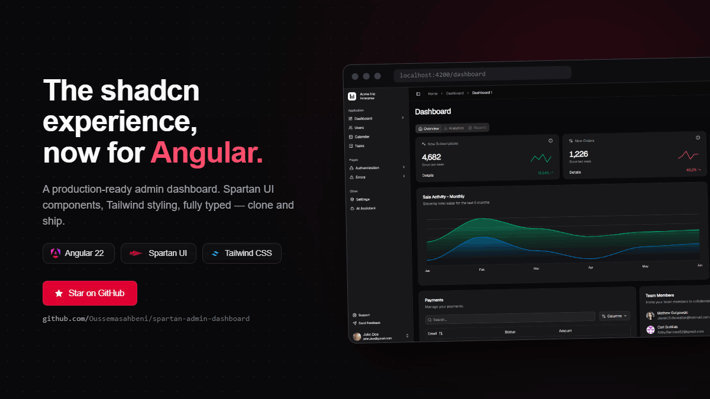

<div align="center">


# Spartan Admin Dashboard

A production-ready, Angular admin dashboard template built with [Spartan UI](https://spartan.ng) components and [Tailwind CSS](https://tailwindcss.com). Clone it and ship.

[](https://angular.dev)
[](https://spartan.ng)
[](https://tailwindcss.com)

</div>




## Features

- **Two dashboards** — overview metrics, charts (ApexCharts), payments tables, and team widgets.
- **User management** — server-style data table with sorting, filtering, pagination, and row actions (backed by a mock API).
- **Task board** — Kanban-style cards with tags, due dates, comments, and completion state.
- **Calendar** — full scheduling UI powered by FullCalendar, with event details and locale-aware rendering.
- **AI assistant** — chat experience with markdown rendering and a typing indicator.
- **Settings** — profile, security, and plan & billing panels.
- **Auth flows** — login, signup, password reset, and two-step verification screens.
- **Light / dark / system theme** and **i18n** for English, French, and Arabic (with full RTL support).
- **Accessibility-first** — built to meet WCAG AA and pass AXE checks.

## Tech stack

| Area | Choice |
|---|---|
| Framework | Angular 22 (standalone, signals, zoneless-ready, OnPush) |
| UI components | Spartan UI (HLM) — vendored locally under `src/app/libs` |
| Styling | Tailwind CSS 4 + `class-variance-authority` + `tailwind-merge` |
| Tables | TanStack Angular Table |
| Charts | ApexCharts (`ng-apexcharts`) |
| Calendar | FullCalendar |
| i18n | Transloco (`en`, `fr`, `ar`) |

## Getting started

> Requires **Node 22+** and **pnpm** (`npm install -g pnpm`).

```bash
# Install dependencies
pnpm install

# Start the dev server at http://localhost:4200
pnpm start
```

## Project structure

```
src/app/
├── core/          # interceptors, guards, services, mock data
├── shared/        # reusable pieces (e.g. the TanStack DataTable wrapper)
├── libs/          # vendored Spartan UI (HLM) components
└── features/      # lazy-loaded feature areas, each owning its own routes
    ├── ai-assistant/
    ├── auth/
    ├── calendar/
    ├── dashboards/
    ├── errors/
    ├── settings/
    ├── tasks/
    └── users/
```

Each feature in `features/<name>/` is lazy-loaded via its own `routes.ts` and owns its components, services, pipes, and models. The two shells are `MainLayout` (authenticated sidebar) and `EmptyLayout` (auth and error pages).

## Contributing

Issues and pull requests are welcome. Please run `pnpm lint` and `pnpm test` before opening a PR.


---

<div align="center">

Built with [Angular](https://angular.dev) · [Spartan UI](https://spartan.ng) · [Tailwind CSS](https://tailwindcss.com)

</div>
