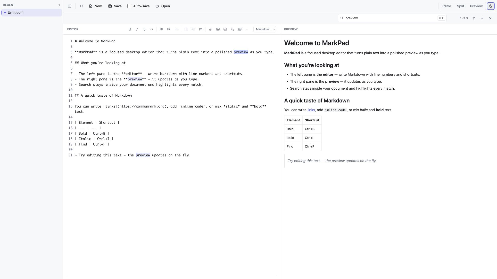
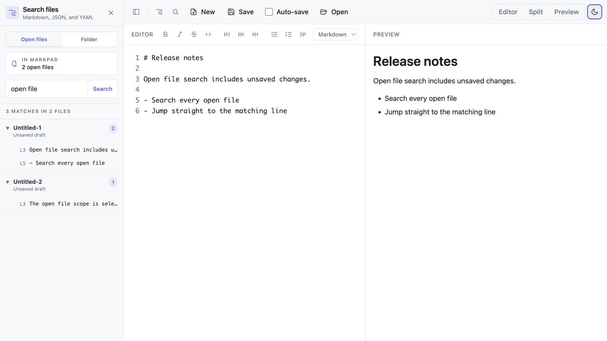
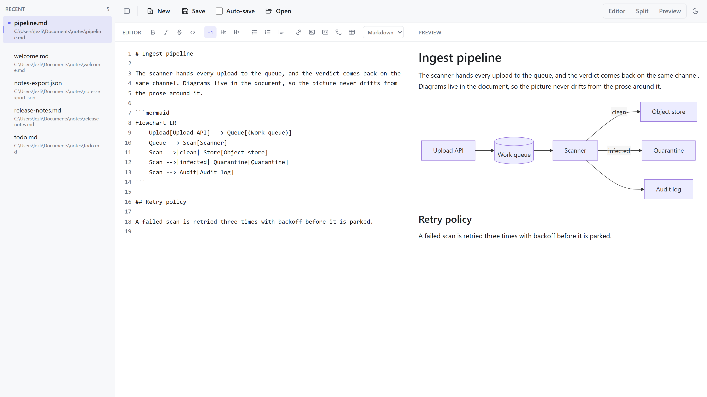
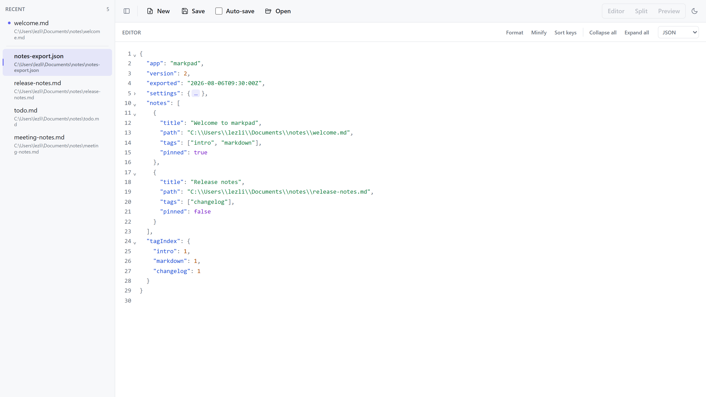
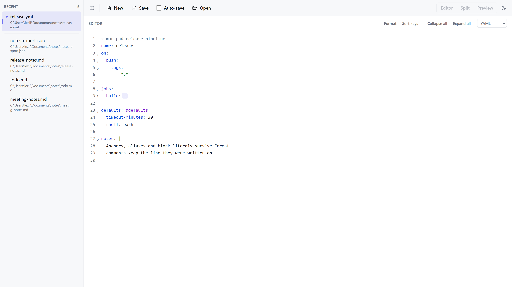

<p align="center">
  
</p>

<h1 align="center">MarkPad</h1>

<p align="center">
  <strong>A lightweight, cross-platform Markdown editor with live preview.</strong>
</p>

<p align="center">
  Edit Markdown on the left, see it rendered on the right — with a recent-files<br>
  sidebar, workspace search, JSON and YAML editing, light/dark theming, auto-save,<br>
  and OS file-association handling, in a small native <code>Tauri</code> app for Windows, Linux, and macOS.
</p>

<p align="center">
  <a href="https://github.com/lezli01/markpad/actions/workflows/ci.yml"></a>
  <a href="https://github.com/lezli01/markpad/releases"></a>
  <a href="LICENSE"></a>
  <a href="https://www.buymeacoffee.com/lezli01"></a>
</p>

<p align="center">
  <a href="#why-markpad">Why</a> &bull;
  <a href="#features">Features</a> &bull;
  <a href="#quick-start">Quick Start</a> &bull;
  <a href="#contributing">Contributing</a> &bull;
  <a href="docs/architecture.md">Architecture</a>
</p>

---

<picture>
  <source media="(prefers-color-scheme: dark)" srcset="docs/images/markdown-dark.png">
  
</picture>

## Why MarkPad?

Most Markdown editors ask for a tradeoff: a heavyweight Electron app that ships a
whole browser to render a text file, a web app that wants your documents in the
cloud, or a bare editor with no live preview at all.

MarkPad is the small, local-first alternative — a native desktop app that opens
quickly, keeps every file on your machine, and shows your Markdown rendered side
by side as you type. A recent-files sidebar, open-file and folder-wide search, a
one-click formatting toolbar, light/dark theming, optional auto-save, and real OS
file-association handling make it usable day to day, without the bloat.

It is released under the [MIT License](LICENSE) and created by `lezli01` at
[lezli01.is-a.dev](https://lezli01.is-a.dev). Contributions are welcome — see
[Contributing](#contributing).

## Features

Open a `.md` file and MarkPad treats editing and previewing as first-class,
side-by-side work:

- **Live split-pane preview.** Edit Markdown in a line-numbered editor on the left, see it rendered on the right.
- **Synced scrolling.** In split view the panes follow each other — scroll either one and the other tracks the same part of the document, staying aligned even across tall images and long code blocks.
- **Find in the active document.** Use the toolbar magnifier or `Ctrl/⌘+F` to open MarkPad's own search bar instead of the webview's full-interface find. Every match is highlighted with a live position/count; `Enter` and `Shift+Enter` move forward and backward with wraparound, and `Escape` closes search. Searching from preview-only mode reveals the editor so the active match stays visible.
- **Search across open files or a folder.** Open the dedicated search sidebar from the toolbar or with `Ctrl/⌘+Shift+F`. It searches every file currently open in MarkPad by default — including unsaved drafts and edits — or you can switch to a selected folder and scan every Markdown, JSON, and YAML file beneath it. Results are grouped by file with paths, matching line numbers, and text previews; selecting one activates the file and places the cursor on that line.

<picture>
  <source media="(prefers-color-scheme: dark)" srcset="docs/images/search-dark.png">
  
</picture>

- **In-document link navigation.** Headings get anchor ids, so clicking an in-page link in the preview — like a table of contents `[Section](#section)` — smooth-scrolls to that heading within the preview pane.
- **Diagrams from fenced code.** A ` ```mermaid ` block renders as a diagram in the preview — flowcharts, sequence, class, state, ER, gantt, pie, mindmap, timeline, git graphs and the rest of [Mermaid](https://mermaid.js.org/)'s catalogue — and ` ```dot ` (or `graphviz`, `gv`) renders [Graphviz](https://graphviz.org/) DOT source. Both engines run entirely on your machine, follow the app's light/dark theme, and load only when a document actually has a diagram in it. Source that does not parse shows the engine's message inline with the block, so a half-typed diagram never blanks the preview.
- **Formatting toolbar.** One-click Markdown formatting from the editor header — bold, italic, strikethrough, inline code, headings, bullet/numbered lists, quotes, links, images, code blocks, diagrams, tables, and horizontal rules — with shortcuts for the common ones (`Ctrl/⌘+B`, `+I`, `+E`, `+K`, and more). Buttons toggle the mark off when reapplied and light up to show the formatting at the cursor.
<picture>
  <source media="(prefers-color-scheme: dark)" srcset="docs/images/diagram-dark.png">
  
</picture>

- **Three view modes.** Editor-only, preview-only, or side-by-side — switch at any time without losing the editor's content, selection, or undo history.
- **JSON file support.** Open a `.json` file (or switch any buffer with the pane-header language toggle) for syntax highlighting, live validation, line numbers, and collapse/expand of objects and arrays — plus one-click Format (2-space indent, `Shift+Alt+F`), Minify, and Sort keys. JSON documents are editor-only; the Markdown preview and format toolbar step aside while one is active.
- **JSON typing comforts.** In a JSON document the editor fills in the punctuation as you type: `{`, `[` and `"` bring their closing partner, typing the closer steps over it, and Backspace between an empty pair removes both. Property names and string values get their quotes from the first character typed — `true`, `false`, `null` and numbers stay bare — and the separating comma appears with the first character of the next member, so a half-finished document is still valid JSON. Typing `:` at the end of a key steps out of the quotes, `}` and `]` re-indent their line, and JSON pasted into an empty buffer is pretty-printed. Every automatic insertion undoes on its own with `Ctrl+Z`.

<picture>
  <source media="(prefers-color-scheme: dark)" srcset="docs/images/json-dark.png">
  
</picture>

- **YAML file support.** Open a `.yaml` or `.yml` file — a workflow, a compose file, a manifest — for syntax highlighting, live validation with the parser's own message, line numbers, and collapse/expand of mappings, sequences and block literals, plus one-click Format (2-space indent, `Shift+Alt+F`) and Sort keys. Both rewrite actions go through a real YAML document model, so comments, anchors, aliases, tags, block literals and multi-document `---` files come back out intact. Like JSON, YAML documents are editor-only.
- **YAML typing comforts.** Enter carries the shape of the line above it: a `- ` item opens the next item at the same indent, an item left empty ends the list and steps back out to the level the sequence hangs off, and a key with no value yet opens its block one level in. Typing `:` after a bare key adds the space YAML requires — `key:value` is a single scalar, not a mapping — brackets and quotes pair as in JSON, and JSON pasted into an empty YAML buffer lands as YAML. Every automatic insertion undoes on its own with `Ctrl+Z`.

<picture>
  <source media="(prefers-color-scheme: dark)" srcset="docs/images/yaml-dark.png">
  
</picture>

- **Recent files sidebar.** A left-hand panel lists up to 50 recently opened items — most-recent first, with modified files pinned to the top and marked. Click one to open it; modified and untitled documents keep their unsaved edits, cursor, and scroll position.
- **Recents context menu.** Right-click an entry for its full path, Copy full path, Copy file name, Reveal in file manager, and the bulk closes — Close, Close others, Close all above, Close all below, Close all saved, and Close all. Bulk closes skip anything with unsaved edits, so they never open a prompt and never lose a draft; each entry shows how many items it would close and greys out at zero.
- **Collapsible, resizable sidebar.** Drag the divider to resize the recent-files or search panel, or hide it entirely for distraction-free writing with the toolbar toggle or `Ctrl+\`; the width and collapsed state persist.
- **New empty file.** Start a fresh Markdown document from the toolbar or `Ctrl+N` / `⌘N`; it appears in the recents list as an untitled draft, and the first Save prompts for a path.
- **Light and dark theme.** Honors the operating system's appearance preference by default, with a manual toggle in the toolbar.
- **Open files from disk.** Native file picker biased toward `.md`, `.markdown`, `.json`, `.yaml`, and `.yml`, with a fallback to all files.
- **Open files from your file manager.** Set MarkPad as the default for `.md`, `.json`, or `.yaml` and a double-click opens MarkPad (or routes to the running instance).
- **One window per user.** MarkPad runs as a single instance; new file requests bring the existing window to the foreground.
- **Save back to disk.** Manual Save plus a visible modified indicator in the recents list so you always know whether your edits are on disk.
- **Optional auto-save.** Tick the box once and edits land on disk shortly after you stop typing, while a file is open.
- **Unsaved-change guard.** Closing an item only drops it from the recents list; the file on disk is untouched. Closing one that has unsaved edits prompts to Save, Discard, or Cancel so reflex clicks don't lose work.
- **Notices outside edits.** Change an open file in another program and MarkPad tells you when you come back to the window, offering **Reload from disk** or **Keep my version**; other open files that changed are marked in the recents list. A file merely touched, or saved with the same content, says nothing. Auto-save pauses until you answer, so it can never overwrite the other program's work behind your back, and a file deleted out from under you says so rather than offering a reload — your copy stays open, and saving writes the file again.
- **Resumes where you left off.** Your recent-files list and the active document are restored on launch — including unsaved drafts and untitled documents, whose contents are saved locally so edits survive a restart. Files that have been moved or deleted are dropped when reopened.
- **Persistent preferences.** Theme, view mode, auto-save, and the sidebar's width and collapsed state are remembered between launches, stored locally.
- **Responsive layout.** Side-by-side on a normal window, stacks vertically at narrow widths.
- **Safe preview.** Rendered HTML is sanitized with DOMPurify before display — diagram SVG included, since it is generated from the same untrusted document.

## Built With

- [Tauri 2](https://tauri.app/) — native desktop shell and filesystem access
- [React 19](https://react.dev/) + [TypeScript](https://www.typescriptlang.org/)
- [Vite](https://vitejs.dev/) — dev server and build
- [CodeMirror 6](https://codemirror.net/) — editor
- [markdown-it](https://github.com/markdown-it/markdown-it) — Markdown rendering
- [yaml](https://eemeli.org/yaml/) — YAML parsing, validation, and comment-preserving rewrites
- [Mermaid](https://mermaid.js.org/) — diagrams from ` ```mermaid ` blocks
- [@viz-js/viz](https://github.com/mdaines/viz-js) — Graphviz, compiled to run in the app
- [DOMPurify](https://github.com/cure53/DOMPurify) — preview sanitization
- [Tailwind CSS](https://tailwindcss.com/) — styling

For a high-level overview, see [`docs/architecture.md`](docs/architecture.md).

## Quick Start

Prerequisites: Node.js LTS, npm, Rust + Cargo, and Tauri 2's
[platform prerequisites](https://v2.tauri.app/start/prerequisites/) for your OS.

Install dependencies:

```sh
npm ci
```

Launch the desktop app:

```sh
npm run tauri dev
```

Or run just the frontend in a browser:

```sh
npm run dev
```

## Development Checks

Frontend:

```sh
npm test
npm run lint
npm run build
```

Rust / Tauri (from `src-tauri/`):

```sh
cargo fmt --all --check
cargo clippy --all-targets --all-features -- -D warnings
cargo check --all-targets --all-features
cargo test
```

## Project Layout

```text
src/             React + TypeScript UI (editor, preview, workspace, toolbar, recents/search panels)
src-tauri/       Rust crate for the Tauri runtime, sessions, file routing, and workspace search
specs/           Feature specifications (one folder per feature)
docs/            Architecture notes and supporting docs
```

## Privacy

MarkPad is local-first. Files stay on your machine and the application does not
send your content over the network. Preferences are stored in the local browser
storage of the desktop runtime. Session state — your recent-files list, the active
document, and any unsaved drafts — is stored locally in your platform's standard
application-data directory; nothing is sent over the network.

## Project Status

Early development, but already usable day-to-day. The split-pane workspace, the
recent-files sidebar with draft persistence, file open/save, view modes, theming,
auto-save, folder-wide content search, JSON and YAML editing with formatting and
folding, OS file-association handling, single-instance routing, outside-edit
detection, and session restore are working today. Specs for shipped and
in-progress features live under
[`specs/`](specs); open issues and follow-ups are in the
[issue tracker](https://github.com/lezli01/markpad/issues).

## Contributing

Contributions of every size are welcome — bug reports, docs, new features, and
test cases. MarkPad is spec-driven and intentionally contributor-friendly: every
meaningful feature begins with a short spec under [`specs/`](specs) and clear
acceptance criteria before implementation. Start here:

- Read the [Contributing guide](CONTRIBUTING.md) for development setup, the
  issue-to-PR workflow, and the checks expected before a pull request.
- Be a good neighbor: this project follows a
  [Code of Conduct](CODE_OF_CONDUCT.md).
- Have a question or an idea? Open a
  [Discussion](https://github.com/lezli01/markpad/discussions).
- Found a bug or want a feature? Open an
  [issue](https://github.com/lezli01/markpad/issues/new/choose).

Releases are automated with
[release-please](https://github.com/googleapis/release-please), so pull requests
use [Conventional Commits](https://www.conventionalcommits.org/) titles. Details
are in [CONTRIBUTING.md](CONTRIBUTING.md).

## Security

MarkPad is local-first and sanitizes all rendered HTML before display, so its
attack surface is small — but security reports are taken seriously. Please do not
open a public issue for suspected vulnerabilities; report them privately via
GitHub's private vulnerability reporting for this repository. See
[SECURITY.md](SECURITY.md) for details.

## License

MarkPad is released under the [MIT License](LICENSE). © 2026 lezli01.
