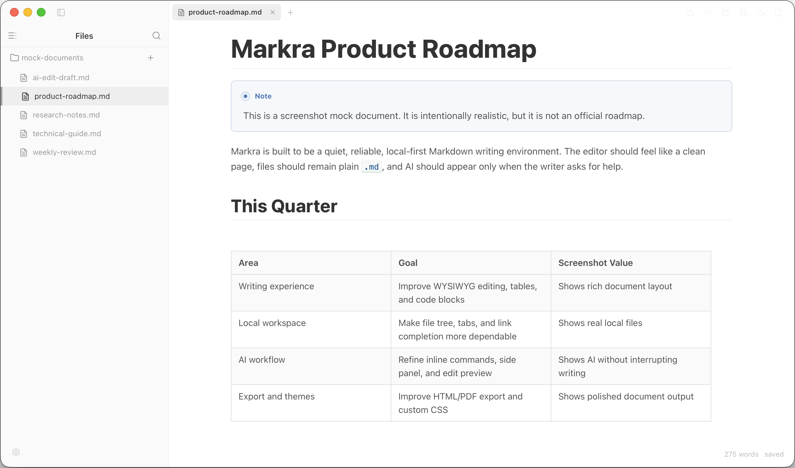
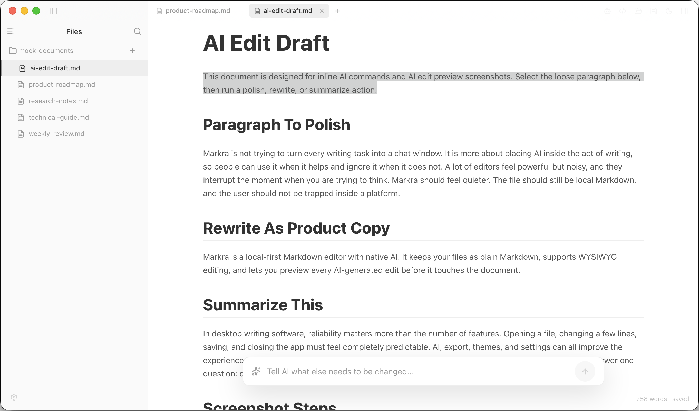
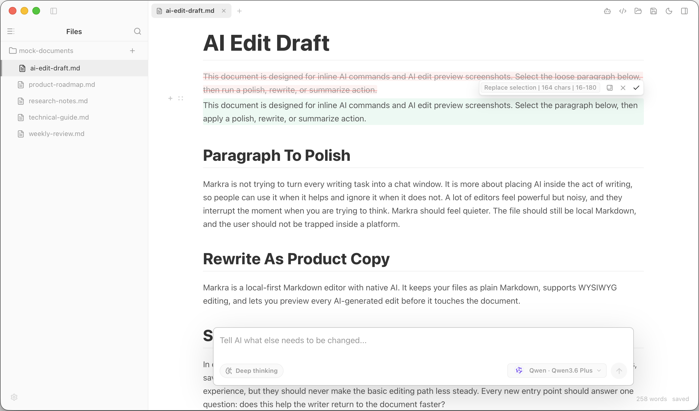
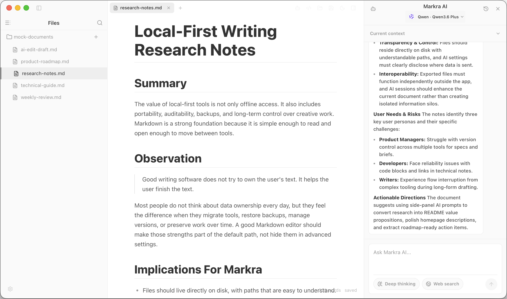
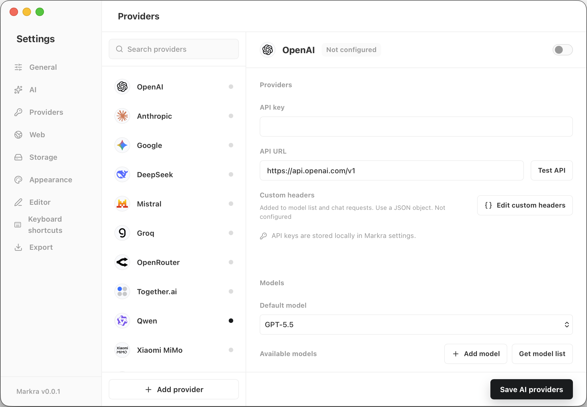

<p align="center">
  
</p>

<p align="center">
  <strong>原生支持 AI 的所见即所得 Markdown 编辑器。</strong>
  <br />
  <strong>完全开源，免费使用。数据默认留在本地。</strong>
</p>

<p align="center">
  <a href="README.md">English</a> | 简体中文 | <a href="https://editor.markra.app/">Web 编辑器</a> | <a href="#下载">下载</a> | <a href="#演示">演示</a> | <a href="#文档">文档</a> | <a href="#对照">对照</a> | <a href="#核心特性">核心特性</a> | <a href="#参与贡献">参与贡献</a> | <a href="#贡献者">贡献者</a> | <a href="#许可证">许可证</a>
</p>

<p align="center">
  
  
  
  
  
  
  
</p>

<h2 align="center">首席赞助</h2>

<p align="center">
  <a href="https://goaihop.com/?utm_source=github&amp;utm_medium=referral&amp;utm_campaign=markra&amp;utm_content=chief_sponsor">
    
  </a>
  <br />
  <a href="https://goaihop.com/?utm_source=github&amp;utm_medium=referral&amp;utm_campaign=markra&amp;utm_content=chief_sponsor"><strong>GoAIHop</strong></a>
  <br />
  AI 中转站导航、比价与实测。
</p>

<p align="center">
  <a href="https://www.buymeacoffee.com/murong" target="_blank" rel="noopener noreferrer">
    
  </a>
  <a href="https://www.producthunt.com/products/markra">
    
  </a>
</p>

Markra 是一个本地优先的开源 Markdown 编辑器，把 AI 融入写作流程。支持所见即所得和源码两种模式，文件以纯 `.md` 格式保存在本地，AI 可以帮你润色、改写或扩写内容——所有修改都先预览，确认后才写入。

无需注册账号。文件默认留在磁盘上；可选的 WebDAV 同步、远程图片存储和 AI 请求只会访问你配置的服务。

## 截图

<p align="center">
  
</p>

<p align="center">
  <strong>所见即所得 Markdown 编辑，本地文件和文档内容在同一个工作区里。</strong>
</p>

| 原生 AI 命令 | 审阅 AI 修改 |
| --- | --- |
|  |  |

| Markra AI 侧边栏 | 多服务商 AI 设置 |
| --- | --- |
|  |  |

## 下载

使用 Web 版编辑器：[editor.markra.app](https://editor.markra.app/)。

macOS 用户也可以通过 Homebrew 安装：

```sh
brew install --cask markrahq/tap/markra
```

从 [GitHub Releases](https://github.com/markrahq/markra/releases/latest) 下载最新桌面版：macOS Apple Silicon/Intel、Windows 安装包/便携包，以及 Linux AppImage、DEB、RPM 和 Arch Linux 安装包。

在 Arch Linux 上，下载 x64 安装包后运行：

```sh
sudo pacman -U ./Markra_<版本号>_linux_x64.pkg.tar.zst
```

## 演示

<p align="center">
  <video src="assets/videos/home_video.mp4" poster="assets/videos/home_video_poster.jpg" controls muted playsinline width="100%"></video>
</p>

<p align="center">
  <a href="assets/videos/home_video.mp4">打开演示视频</a>
</p>

## 文档

- [更新日志](CHANGELOG.md)
- [隐私与数据流](docs/privacy.md)
- [贡献指南](CONTRIBUTING.md)

## 桌面版与 Web 版

| 能力 | 桌面版 | Web 版 |
| --- | --- | --- |
| 所见即所得和源码编辑 | 完整编辑体验 | 完整编辑体验 |
| 打开本地文件和文件夹 | 原生文件对话框、真实路径和文件监听 | 浏览器文件选择、文件夹选择和文件句柄 |
| 文件树操作 | 新建、重命名、移动、删除、排序、定位和多选 | 在浏览器权限允许时新建、重命名、移动和删除 |
| 自动保存和状态恢复 | 已有文件、标签页、草稿和工作区窗口 | 支持浏览器文件句柄和 IndexedDB 状态时可用 |
| AI 服务商 | 通过原生运行时请求，支持应用代理设置 | 浏览器直接请求，受服务商 CORS 支持限制 |
| 拼写检查 | Markra 自维护本地拼写检查，支持按需下载语言包和个人白名单 | 暂不可用 |
| 图片存储 | 本地文件夹、WebDAV、PicGo/PicList 和 S3 兼容存储 | 本地/浏览器文件句柄，以及 CORS 允许时的 WebDAV |
| 备份与同步 | 本地备份、WebDAV 笔记同步，以及本地文件、WebDAV 或 S3 兼容存储的配置备份 | 支持本地文件配置备份，并在 CORS 允许时支持 WebDAV；不支持笔记备份与同步 |
| 导出 | HTML、PDF，以及配置 Pandoc 后的更多格式 | HTML 下载和浏览器打印/PDF |

## 对照

Markra 并不是想替代所有 Markdown 工具。它更接近一个安静的本地文档编辑器，并把 AI 编辑流做成原生能力。

| 关注点 | Markra | Typora | Obsidian |
| --- | --- | --- | --- |
| 主要适合 | 本地优先 Markdown 写作，内置 AI 编辑 | 极简 live-preview Markdown 写作 | 个人知识库和双链笔记 |
| 编辑模型 | 所见即所得文档表面，加完整源码模式 | 写作时隐藏 Markdown 语法的实时预览 | Markdown 笔记，支持阅读/实时预览编辑模式 |
| AI 工作流 | 原生内联操作、侧边栏和 ACP 本地 Agent，修改先预览再应用 | 不是核心产品工作流 | 不是核心产品工作流；插件能力因配置而异 |
| 拼写检查 | Markra 自维护本地词典，语言包按需下载，支持修正建议和个人白名单 | 支持平台系统拼写检查，必要时使用 Hunspell 词典 | Electron/Chromium 风格的编辑器拼写检查，可配置检查语言 |
| 文件模型 | 普通 `.md` 文件，支持单文件或文件夹工作区 | 普通 Markdown 文件和文件夹/文件树工作流 | 使用开放文件格式的本地 vault |
| 知识组织 | 标签页、大纲、全局搜索和双链补全 | 大纲、文件树、内部链接和偏写作/导出的工具 | 反向链接、图谱视图、Canvas 和大型插件生态 |
| 同步与存储 | 可选 WebDAV 同步、本地备份和可配置图片存储 | 使用本地文件，可配合外部同步服务 | 可选付费 Obsidian Sync 和 Publish 服务 |
| 开放与费用 | 免费，AGPL-3.0 开源 | 试用后付费 | 应用免费，可选付费服务和许可证 |

## 核心特性

### 所见即所得 Markdown

- 链接、图片、HTML、KaTeX 公式、Mermaid 图表和 GFM 表格均可内联渲染，随时展开回源码。
- 斜杠菜单和拖拽手柄进行块级编辑，一键切换完整源码模式。
- 可调整正文宽度、字号和行高。
- 桌面版拼写检查会标记疑似错误，默认按 `Ctrl/Cmd+.` 查看建议或加入个人白名单；建议菜单快捷键可在键盘快捷键设置里修改。
- Markra 自维护本地词典，不依赖系统或 Electron 拼写检查，让桌面端跨平台行为更一致；语言包按需下载，不打进安装包。

### 原生 AI

- 选中文本使用内联 AI，或打开侧边栏处理整篇文档。
- 内置快捷操作：润色、改写、续写、总结、翻译。
- 每次 AI 修改都先预览——接受、拒绝或复制，由你决定。
- 内置侧边栏 Agent 会从工作区根目录到当前文档目录逐层读取并合并 `AGENTS.md`。
- 可在 `.agents/skills/<skill-name>/SKILL.md` 添加工作区 Skill；Agent 会先提供描述，仅在 `$skill-name` 显式调用或工具模型按描述匹配后加载完整指令。同名 Skill 由更接近当前文档的目录覆盖。
- 支持 Agent Client Protocol（ACP），可连接兼容的本地 AI Agent，并支持模型发现、权限确认和编辑器写入预览。
- 会话支持搜索、重命名和归档。

### 本地工作区

- 打开单个文件或整个文件夹，在文件树中浏览、新建、重命名、移动、删除、排序、定位和多选文件。
- 文档标签页、分屏窗格、快速打开、全局搜索、大纲导航和双链补全。
- 自动保存已有路径的文件，恢复标签页和工作区状态，并显示文档或选中文本字数。

### 存储、备份与同步

- 粘贴或拖入图片可存到本地、WebDAV、PicGo/PicList 或 S3 兼容存储。
- 手动、退出时或定时创建本地单向备份。
- 可选 WebDAV 双向同步，让多设备笔记保持一致，并保留冲突副本。
- 将可移植配置备份到本地文件、WebDAV 或 S3 兼容存储，并在其他设备上恢复；默认不包含敏感凭据。

### 块、表格与代码

- GitHub 风格提示块（note、tip、important、warning、caution）。
- 可视化表格控件，调整行列、尺寸和对齐。
- 语法高亮代码块，支持语言选择和一键复制。

### 主题与导出

- 内置主题或限定作用域的自定义 CSS，支持导入/导出/重置。
- 导出为独立 HTML 或 PDF，完整控制页面、边距和元数据。

### 多服务商 AI

支持云端模型、本地模型和任意 OpenAI 兼容接口，内联编辑和侧边栏可分别选择模型。

**内置服务商：** OpenAI · Anthropic · Google Gemini · DeepSeek · Mistral · Groq · OpenRouter · Together.ai · Qwen · Xiaomi MiMo · Volcengine Ark · xAI · Azure OpenAI · Ollama

**联网搜索：** 服务商原生搜索、Bing 和 SearXNG——结果数量和正文长度均可配置。

## 适用场景

产品文档 · 博客长文 · 研究笔记 · 含表格/代码/公式的技术写作 · AI 辅助起草与润色 · 个人知识库

## 设计理念

- **本地优先** — 文件和工作区数据默认留在你的磁盘上，除非你主动启用 WebDAV 同步或远程图片存储。
- **开源免费** — 核心功能可审计，永不设付费墙。
- **写作优先** — AI、文件管理和设置都服务于文档，而不是反过来。
- **确认后再应用** — AI 修改是预览，由你决定是否写入。

## 路线图

- 更稳定的工作区行为和边界情况处理
- 更智能的 AI 编辑预览和冲突解决
- 更深入的知识组织和链接工作流
- 更丰富的导出模板和分享流程

## 开始使用

1. 打开 [Web 版编辑器](https://editor.markra.app/)，或[下载](https://github.com/markrahq/markra/releases/latest)适合你平台的最新桌面版。
2. 打开一个 Markdown 文件或文件夹。
3. 开始写作——所见即所得、斜杠菜单或源码模式均可。
4. 准备好使用 AI 时，在设置里配置服务商和模型。

## 参与贡献

欢迎贡献——无论是产品体验、Markdown 编辑、AI 工作流、跨平台修复还是文档改进。查看 [issues](https://github.com/markrahq/markra/issues) 了解开放任务，或直接发起讨论。

## 贡献者

感谢每一位通过代码、文档、设计、测试和反馈帮助 Markra 变得更好的人。

<p align="center">
  <a href="https://github.com/markrahq/markra/graphs/contributors">
    
  </a>
</p>

## Sponsors

[](https://sponsors.mrong.me/)

## 许可证

Markra 使用 AGPL-3.0 许可证。
