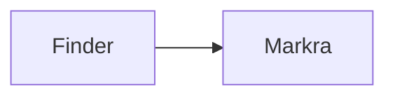

# Synthetic Quick Look Preview

This fixture verifies **Markdown**, tables, math, diagrams, and local images.

> [!WARNING]
> Synthetic callout content.

| Feature | Status |
| --- | --- |
| Quick Look | Ready |

Inline math: $x^2 + y^2 = z^2$.

