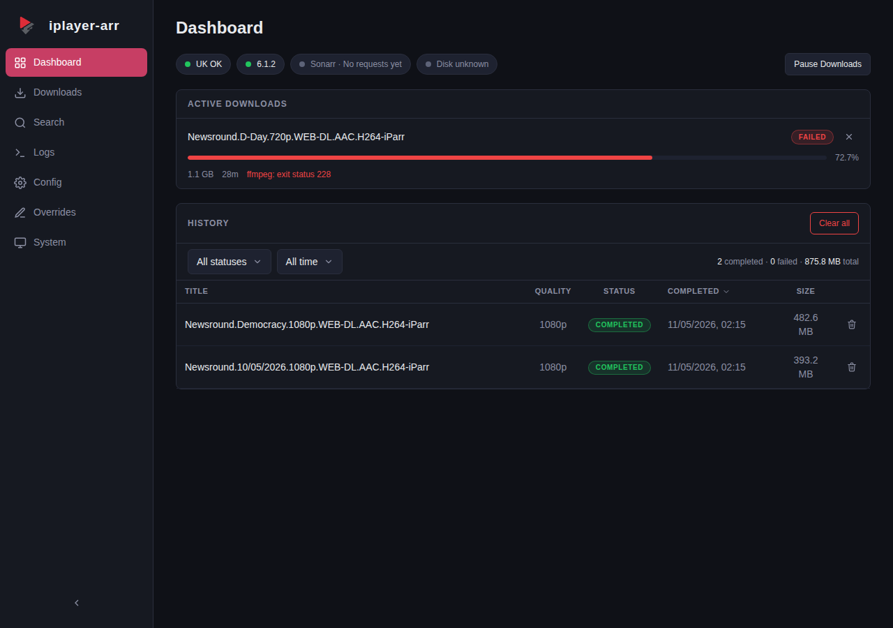

<p align="center">
  
</p>

<p align="center">BBC iPlayer download manager that plugs into Sonarr as both an indexer and download client.</p>

[](https://github.com/Will-Luck/iplayer-arr/actions/workflows/ci.yml)
[](https://github.com/Will-Luck/iplayer-arr/releases)
[](LICENSE)
[](https://github.com/Will-Luck/iplayer-arr/pkgs/container/iplayer-arr)
[](https://hub.docker.com/r/willluck/iplayer-arr)
[](https://github.com/Will-Luck/iplayer-arr/pkgs/container/iplayer-arr)
[](https://github.com/Will-Luck/iplayer-arr/pkgs/container/iplayer-arr)
[](https://github.com/Will-Luck/iplayer-arr/pkgs/container/iplayer-arr)



## How it works

Most iPlayer download tools grab programmes by URL and leave you with a file to sort out yourself. iplayer-arr speaks Sonarr's language natively -- it presents a Newznab indexer for search and a SABnzbd download client for fetching, so Sonarr treats it like any other indexer/downloader pair.

The hard part is episode numbering. BBC iPlayer doesn't follow a consistent scheme -- some shows have full series/episode metadata, others only have a position index within a series, and daily shows often have nothing but an air date. Sonarr expects TheTVDB-style S01E03 numbering, and the two rarely agree out of the box.

iplayer-arr solves this with a 4-tier resolution chain:

1. **Full** -- BBC provides series + episode number, used directly
2. **Position** -- no episode number, but the programme has a position in its series (e.g. 3rd of 6), mapped to S01E03
3. **Date** -- no numbering at all, air date used as the episode identifier (2026.01.15)
4. **Manual** -- title only, last resort

When the auto-resolved numbering still doesn't match TheTVDB (common with specials, reboots, or shows where the BBC counts differently), per-show overrides let you adjust series/episode offsets, force date-based numbering, or remap programme names -- all from the web UI.

## Features

- Newznab indexer + SABnzbd download client in one container
- 4-tier episode identity resolution with per-show overrides
- HLS stream download with quality selection (1080p/720p/540p/396p)
- Real-time dashboard with SSE progress and download history
- Built-in WireGuard VPN via hotio base image (off by default)
- Setup wizard walks you through Sonarr configuration
- BBC iPlayer search with thumbnails and one-click download
- System health page with geo check, disk usage, ffmpeg status

## Quick Start

> **Important**: You must hold a valid UK TV Licence to legally access BBC iPlayer content via iplayer-arr. iplayer-arr does not verify this and assumes you are compliant. See [DISCLAIMER.md](DISCLAIMER.md) for full legal terms.

> **Running Unraid?** Install the Community Applications template from [Will-Luck/unraid-templates](https://github.com/Will-Luck/unraid-templates) rather than the `docker run` command below. The template pre-configures the VPN variables and the `NET_ADMIN` capabilities required when `VPN_ENABLED=true`.

```bash
docker run -d \
  --name iplayer-arr \
  -p 62001:62001 \
  -v iplayer-arr-config:/config \
  -v /path/to/downloads:/downloads \
  -e TZ=Europe/London \
  -e PORT=62001 \
  ghcr.io/will-luck/iplayer-arr:latest
```

Or with Docker Compose:

```yaml
services:
  iplayer-arr:
    image: ghcr.io/will-luck/iplayer-arr:latest
    container_name: iplayer-arr
    ports:
      - 62001:62001
    volumes:
      - iplayer-arr-config:/config
      - /path/to/downloads:/downloads
    environment:
      - TZ=Europe/London
      - PORT=62001  # must match the container-side port in ports: above
    restart: unless-stopped

volumes:
  iplayer-arr-config:
```

> iPlayer requires a UK IP address. Enable the built-in VPN or run behind an existing UK VPN/proxy. See the [VPN Configuration](https://github.com/Will-Luck/iplayer-arr/wiki/VPN-Configuration) wiki page.
>
> **If you set `VPN_ENABLED=true`, the examples above are not sufficient.** You must also pass `--cap-add=NET_ADMIN` and `--sysctl net.ipv4.conf.all.src_valid_mark=1` (or the Compose equivalent) or the container will crash-loop at startup with `[VPN] Not the right capabilities`. Full example: [VPN Configuration → Docker Capabilities](https://github.com/Will-Luck/iplayer-arr/wiki/VPN-Configuration#docker-capabilities).

Open `http://localhost:62001` and the setup wizard will guide you through connecting Sonarr. Its first step asks for the API key.

## API key

One key protects everything: the dashboard API, the Newznab indexer and the SABnzbd download client. iplayer-arr generates one on first start if you do not supply your own.

**Getting the key.** It is written to your config directory on every start, owner-readable only:

```bash
docker exec iplayer-arr cat /config/api_key
```

If `/config` is a host bind mount you can read the file directly instead.

**Setting your own.** Pass `API_KEY` and it takes precedence over the generated value. It must be at least 16 characters; a shorter one is refused at startup with an explanation rather than silently accepted. This is the supported way to pin a key across rebuilds, to rotate one, or to provision a container from a secrets manager:

```bash
docker run -d \
  --name iplayer-arr \
  -e API_KEY=your-own-long-random-value \
  ...
```

To rotate: set a new `API_KEY`, restart the container, then update the key in the iplayer-arr Config page and in the Sonarr and Radarr indexer and download-client entries.

**Where it is not available.** `GET /api/config` does not return the key, and the log records at most a four-character prefix, and nothing at all for a key short enough that four characters would be a meaningful share of it. Both are deliberate. Until v1.7.0 the dashboard API was unauthenticated and that endpoint handed the key to anyone who could reach the port ([GHSA-3hfw-5v8p-p588](https://github.com/Will-Luck/iplayer-arr/security/advisories)).

**In the browser.** The dashboard stores the key in `localStorage` for the browser you enter it in. Each browser or device you use needs it entered once. `GET /api/healthz` is the only endpoint that answers without it, so container health checks and uptime monitors keep working.

**Sending the key to `/api/*`.** Three forms are accepted: `Authorization: Bearer <key>`, `X-Api-Key: <key>`, and `?apikey=<key>`.

| Request | Accepted credential |
| --- | --- |
| `GET`, `HEAD`, `OPTIONS` | any of the three |
| `POST`, `PUT`, `PATCH`, `DELETE` | **a header only** (`Authorization: Bearer` or `X-Api-Key`) |

A state-changing request also passes a same-origin check. An absent `Origin` is not treated as trusted on its own, so a query-only `POST`, `PUT`, `PATCH` or `DELETE` is refused with `403 cross-origin request refused` even when the key is correct. Browsers cannot set those headers cross-origin without a preflight this service does not answer, which is what makes the rule worth having. Move the key into a header and the call works:

```bash
# 403: query-only credential on a state-changing request
curl -X POST "http://localhost:62001/api/pause?apikey=$KEY"

# 200
curl -X POST -H "X-Api-Key: $KEY" http://localhost:62001/api/pause
```

`/newznab/*` and `/sabnzbd/*` are unaffected: Sonarr and Radarr keep using `?apikey=` exactly as before.

**Live updates and reverse proxies.** The dashboard's event stream uses `EventSource`, which cannot set request headers, so `/api/events` carries the key as a query parameter. A reverse proxy in front of iplayer-arr will therefore record the key in its access log for that one request. If that matters to you, exclude `/api/events` from request logging or drop the query string for it.

## Environment variables

The full list lives in the [Configuration Reference](https://github.com/Will-Luck/iplayer-arr/wiki/Configuration-Reference). The ones that control the listener and the key:

| Variable | Default | Purpose |
| --- | --- | --- |
| `PORT` | `62001` | TCP port to listen on. |
| `BIND_ADDR` | *(empty)* | Interface to bind. Empty means all interfaces, which is what a published container wants. Set it to `127.0.0.1` to confine the listener to loopback, which suits running the binary directly on a host. |
| `API_KEY` | *(unset)* | Pins the API key. At least 16 characters. Unset means the stored key is kept, or a 32-character one is generated on first start. |
| `CONFIG_DIR` | `/config` | Holds the database and the `api_key` file. |
| `DOWNLOAD_DIR` | `/downloads` | Where completed files land. |

## Radarr setup

Some BBC one-offs (feature-length documentaries, specials) are catalogued
as movies on TMDB rather than series on TVDB, so requests for them route
to Radarr. iplayer-arr serves these through the same two endpoints as
Sonarr:

1. **Indexer** - Settings > Indexers > Add > Newznab. URL and API key are
   identical to the Sonarr indexer entry. Radarr reads the caps and uses
   text search (`q` + `year`); no TMDB/IMDb ID lookup is advertised. Radarr's
   indexer test uses `t=movie`, and its real searches arrive as `t=search`
   with Movies categories; iplayer-arr routes both to the movie path, so
   test and live searches behave the same.
2. **Download client** - Settings > Download Clients > Add > SABnzbd, same
   host/port/API key as the Sonarr entry. The default `movies` category is
   listed by the shim and flows through unchanged.
3. **Set the indexer's download client (do this if you run any other
   downloader).** If Radarr already has a real SABnzbd or NZBGet configured,
   open the iplayer-arr indexer entry and set its **Download Client** field
   to the iplayer-arr download-client entry. Otherwise Radarr sends iPlayer
   grabs to the wrong client and they fail.

> **Reachability:** Radarr must be able to reach iplayer-arr over the
> network. If Radarr runs in a VPN-isolated container, point it at a
> container-network address (for example a Docker network hostname) rather
> than a host-published port, which the VPN kill switch blocks.

How grabs work: release titles come from the matched BBC brand/subtitle
metadata with the year appended, not from your search query (Radarr strips
leading articles from the query, so an echo could never match an
article-bearing TMDB title). Results are filtered by name against BBC
brand/subtitle metadata within a +/-1 year window. Radarr's indexer test
and RSS sync poll without a query and receive the BBC films rail (up to 10
titles) so the test passes; targeted grabs happen when Radarr searches on
add, on a monitored movie, or interactively.

## Configuration

See the [Configuration Reference](https://github.com/Will-Luck/iplayer-arr/wiki/Configuration-Reference) for the full list of environment variables, application settings, and VPN options.

## Documentation

See the [Wiki](https://github.com/Will-Luck/iplayer-arr/wiki) for:

- [Installation](https://github.com/Will-Luck/iplayer-arr/wiki/Installation) (Docker, Compose, VPN setup)
- [Configuration Reference](https://github.com/Will-Luck/iplayer-arr/wiki/Configuration-Reference) (environment variables, settings)
- [Sonarr Integration](https://github.com/Will-Luck/iplayer-arr/wiki/Sonarr-Integration) (indexer and download client setup)
- [Web UI Guide](https://github.com/Will-Luck/iplayer-arr/wiki/Web-UI-Guide) (page-by-page walkthrough)
- [Episode Overrides](https://github.com/Will-Luck/iplayer-arr/wiki/Episode-Overrides) (fixing numbering mismatches)
- [REST API Reference](https://github.com/Will-Luck/iplayer-arr/wiki/REST-API-Reference)
- [Troubleshooting](https://github.com/Will-Luck/iplayer-arr/wiki/Troubleshooting)

In-tree: [`docs/testing.md`](docs/testing.md) for the diag endpoints and regression-anchor pattern used in CI.

## Legal

iplayer-arr is not affiliated with, endorsed by, or sponsored by the BBC. iPlayer is a trademark of the British Broadcasting Corporation. Users in the UK must hold a valid TV Licence to legally access BBC iPlayer content via this tool.

- [DISCLAIMER.md](DISCLAIMER.md) - full legal terms, TV Licence requirement, personal-use restriction
- [SECURITY.md](SECURITY.md) - security and abuse reporting via GitHub's Private Vulnerability Reporting

## Licence

GPL-3.0. See [LICENSE](LICENSE).

---

*iplayer-arr is not affiliated with, endorsed by, or sponsored by the BBC. iPlayer is a trademark of the British Broadcasting Corporation.*
