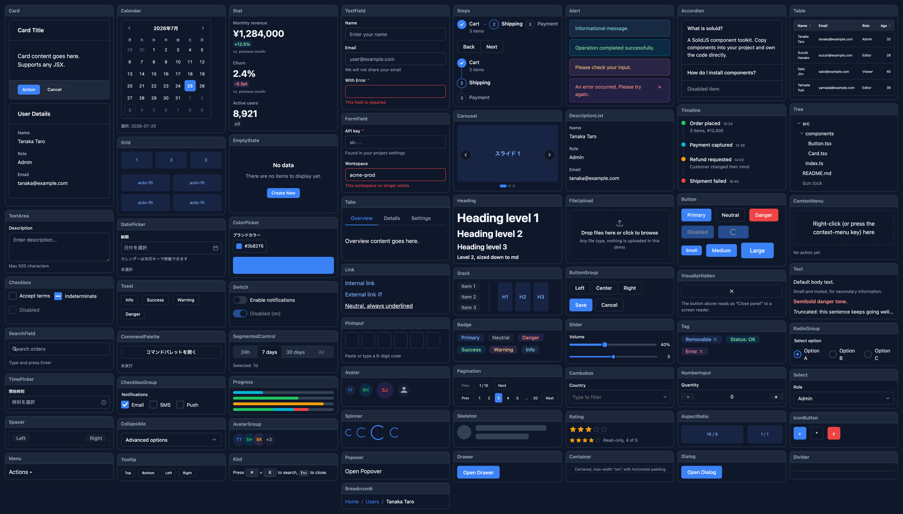
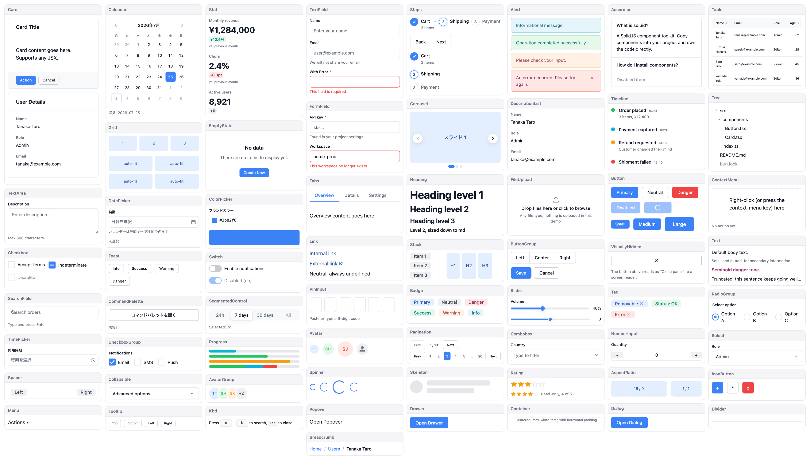

# soluid

[](https://www.npmjs.com/package/soluid)
[](./LICENSE)

CLI that installs SolidJS UI components directly into your project. Own the code, no runtime dependency.

[Website & Demo](https://misebox.github.io/soluid/) · [Changelog](./CHANGELOG.md)

<p align="center">
  
  
</p>

## Features

- **Rich component set** — layout, form, data display, feedback, navigation
- **CLI-driven install** — `bunx soluid install`, no manual copy-paste
- **Own the code** — components live in your repo, fully customizable
- **No runtime dependency** — zero JS added to your bundle
- **Dark mode & density** — CSS variable-based theming out of the box
- **TypeScript** — fully typed props for every component

## Usage

No global install required. Run directly:

```sh
bunx soluid init                # create soluid.config.json interactively
bunx soluid install             # download and install components + CSS
bunx soluid add <component...>  # add components to config
bunx soluid remove <comp...>    # remove components from config
bunx soluid list                # list available components
```

## Config

`soluid.config.json`

```json
{
  "componentsVersion": "0.2.13",
  "componentDir": "src/components/ui",
  "cssPath": "src/soluid.css",
  "components": ["Button", "TextField", "Dialog"]
}
```

`cssPath` receives all component CSS concatenated into a single file.

## Setup

Import CSS in your app entry point:

```tsx
// src/index.tsx
import "./soluid.css";
```

Theme and density switching:

```tsx
document.documentElement.setAttribute("data-theme", "dark");
document.documentElement.setAttribute("data-density", "dense");
```

## Components

See the full list with live demos at [misebox.github.io/soluid](https://misebox.github.io/soluid/).

## Development

See [DEVELOPMENT.md](./DEVELOPMENT.md).
