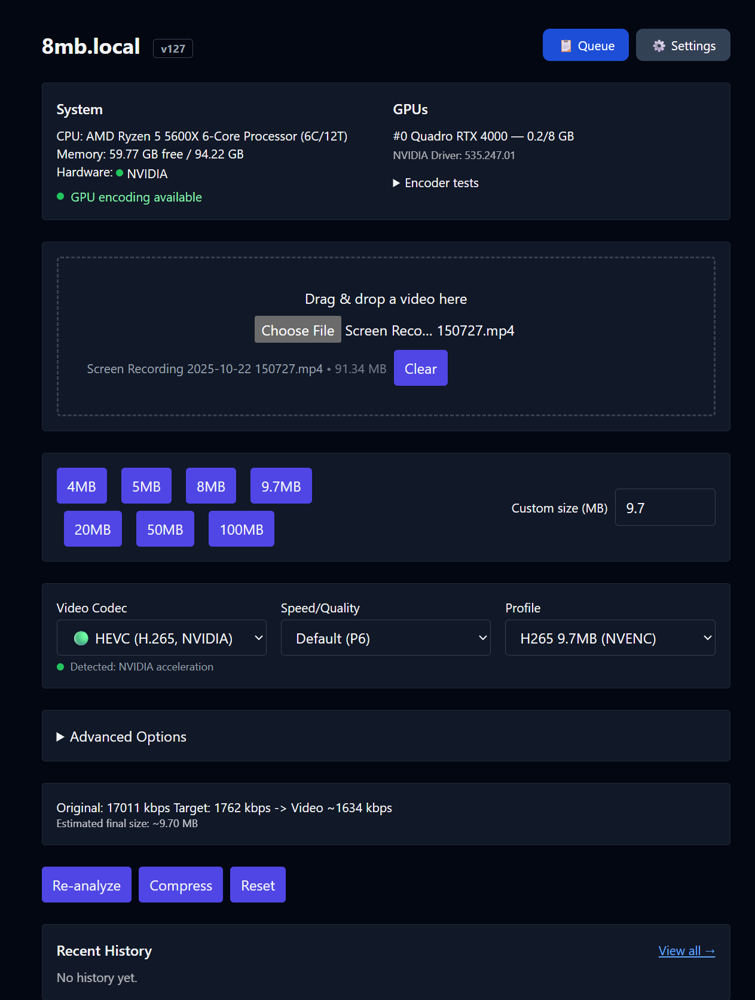
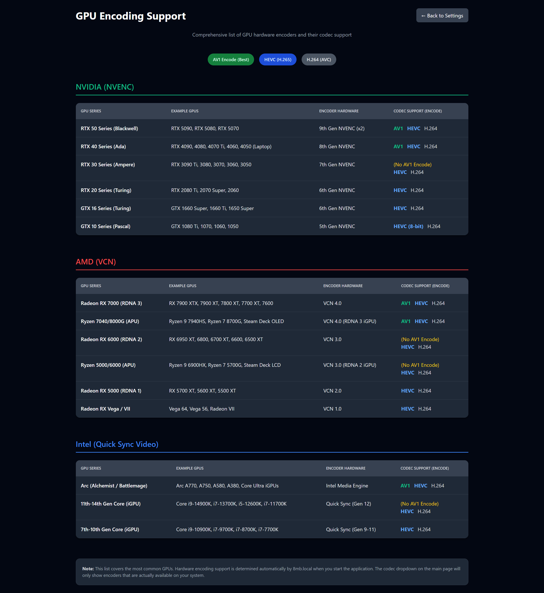
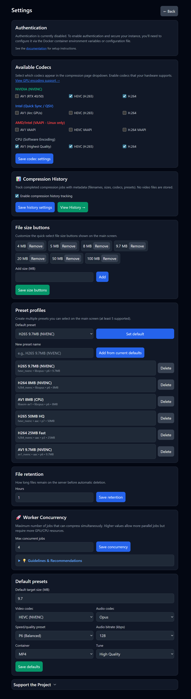
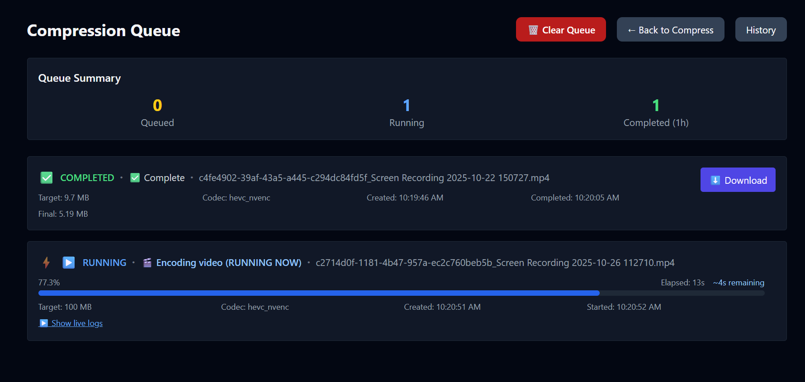
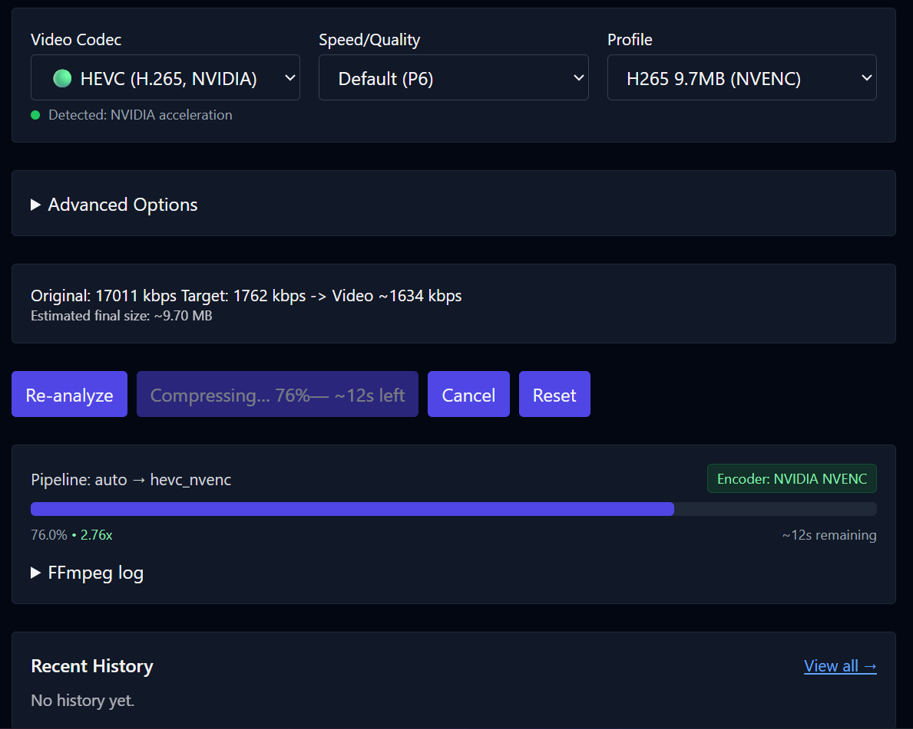
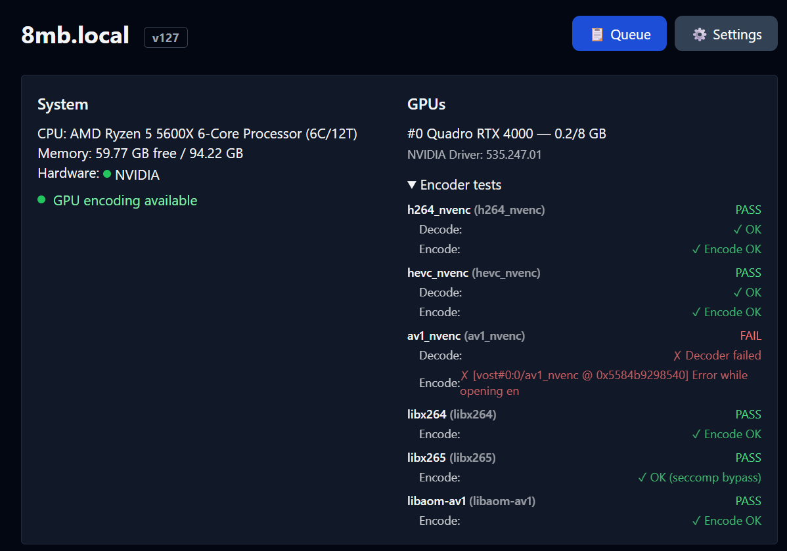
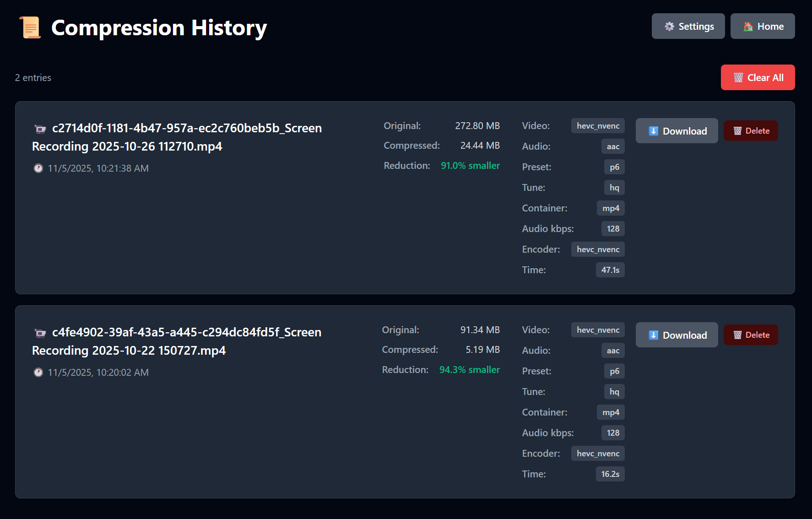
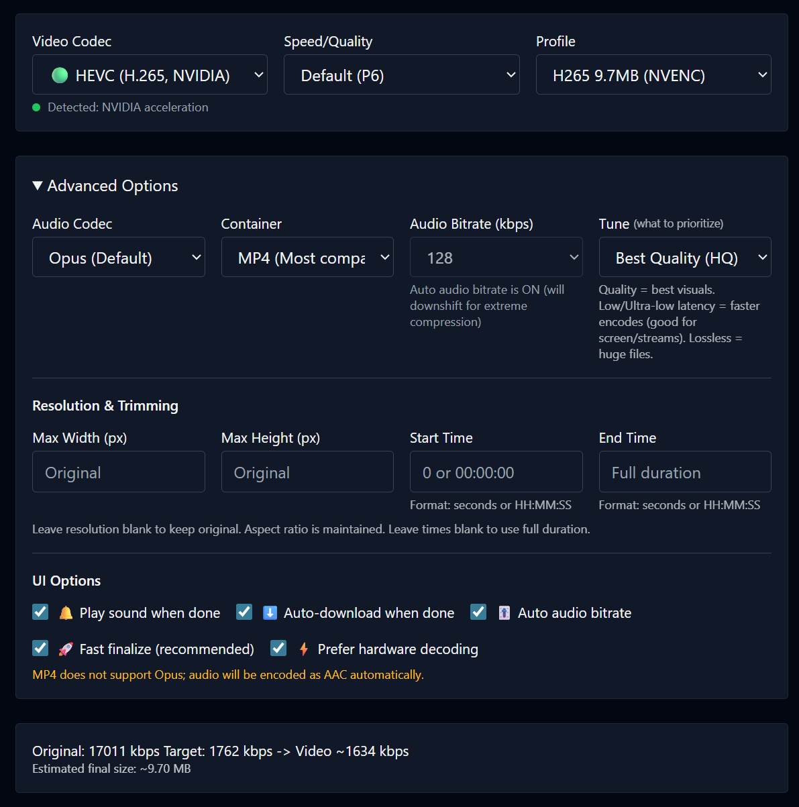
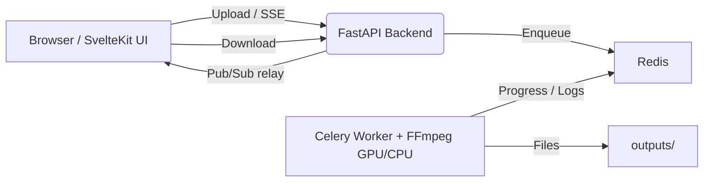

# 8mb.local – Self-Hosted GPU Video Compressor

8mb.local is a self-hosted, fire-and-forget video compressor. Drop a file, choose a target size (e.g., 8 MB, 25 MB, 50 MB, 100 MB), and let GPU-accelerated encoding produce compact outputs with AV1/HEVC/H.264. Supports **NVIDIA NVENC**, **Intel Quick Sync**, **Windows AMD AMF**, and **Linux VAAPI** (including AMD) with automatic **CPU fallback**. The Docker deployment uses a SvelteKit UI, FastAPI backend, Celery worker, Redis broker, and real-time progress via Server-Sent Events (SSE). The native Windows installer runs the same UI/API/worker code with a local in-process queue.

<p align="center">
  <a href="https://www.youtube.com/watch?v=1YDjDtZ21lc">
    
  </a>
  <br/>
  <b>Video Demo</b>
</p>

## Table of Contents

- [Features](#features)
- [Screenshots](#screenshots)
- [Projects](#projects)
- [Architecture](#architecture)
- [Installation](#installation)
- [Usage](#usage)
- [Configuration](#configuration)
- [Performance & Concurrency](#performance--concurrency)
- [Reverse Proxy Configuration](#reverse-proxy-configuration)
- [Troubleshooting](#troubleshooting)
- [License](#license)

## Features

- **NVIDIA NVENC, Intel QSV, Windows AMD AMF, and Linux VAAPI hardware encoding** with automatic CPU fallback when a GPU or driver is unavailable
- **Robust encoder validation** at startup — tests actual encoder initialization, not just availability
- **AV1, HEVC (H.265), and H.264** encoding via NVENC, QSV, AMF, VAAPI, or CPU software encoders
- Drag-and-drop UI with helpful presets and advanced options (codec, container, tune, audio bitrate)
- **Configurable codec visibility** — enable/disable specific codecs in the Settings page
- **Resolution control** — set max width/height while maintaining aspect ratio
- **Video trimming** — specify start/end times (seconds or HH:MM:SS format)
- **Real-time progress tracking** using output size, time processed, bitrate, and wall-clock estimates
- **Real-time FFmpeg logs** streamed during compression
- **Live queue management** — view all active jobs with real-time progress, cancel individual jobs, or clear entire queue
- **Automatic file size optimization** — re-encodes with adjusted bitrate if output exceeds target by >2%
- **Batch processing** — compress multiple files in a single operation
- **Job history** enabled by default
- **Auto-download** enabled by default
- Output container choice: MP4 or MKV, with compatibility safeguards
- **Version tracking** — UI displays current version, backend provides `/api/version`

## Screenshots

<table>
  <tr>
    <td align="center">
      <b>Main Interface</b><br/>
      
    </td>
    <td align="center">
      <b>GPU Support List</b><br/>
      
    </td>
    <td align="center">
      <b>Settings Panel</b><br/>
      
    </td>
  </tr>
  <tr valign="top">
    <td align="center">
      <b>Live Queue</b><br/>
      
    </td>
    <td align="center">
      <b>Compressing (Real-time Logs)</b><br/>
      
    </td>
    <td align="center">
      <b>Encoder Validation Tests</b><br/>
      
    </td>
  </tr>
  <tr valign="top">
    <td align="center">
      <b>Job History</b><br/>
      
    </td>
    <td align="center">
      <b>Advanced Options</b><br/>
      
    </td>
    <td></td>
  </tr>
</table>

## Projects

Public instances run by people who offer their **8mb.local** install for anyone to use (community compressors, demos, mirrors). If you run a public deployment and want it listed here, open a pull request that adds a row to this section.

| Site | Notes |
|------|--------|
| [fits.video](https://fits.video/) | Online compressor (free and open source) |

## Local Release Workflow

This repository is one shared source codebase for the frontend, backend, worker, Windows packages, and Docker image. The root `VERSION` file is the single active application-version source. Generated UI/backend version modules and packaging metadata are synchronized by `scripts\set-version.ps1` and verified by `scripts\check-version.ps1`.

One command runs the automated checks and builds the portable EXE, installer EXE, Store MSIX, and local Docker image:

```powershell
.\release-local.ps1 -Version 142.0.0.0
```

GitHub is not required to generate these files. GitHub Actions may still provide an independent compatibility check later. The local workflow never pushes its Docker image, publishes a release, deploys the application, or submits the MSIX; Microsoft Partner Center remains a separate manual submission step.

The UI, backend API, EXE metadata, installer metadata, MSIX manifest, Docker metadata/tag, artifact names, and release directory all derive from the requested four-part version. By default, outputs and stage logs are written to `dist\release\<version>\`:

- `8mblocal.exe`
- `8mblocal-Setup.exe`
- `8mblocal_<version>_x64.msix`
- `8mblocal-docker.tar`
- `SHA256SUMS.txt`
- `BUILD-MANIFEST.json`
- `TEST-RESULTS.md`

Required tools depend on the selected stages: Python 3.11-3.13, Node.js, npm, Docker with Compose, Inno Setup, Windows SDK MakeAppx, and 7-Zip when the Windows build must download its tested FFmpeg bundle. The script checks tools before building and fails with a clear missing-tool message; it does not install unrelated software or perform system upgrades.

Prepare the Python test environment once after cloning:

```powershell
python -m venv .venv
.\.venv\Scripts\python.exe -m pip install -r requirements.txt httpx==0.27.2
```

Useful commands:

```powershell
# Validate tools and show the plan without changing versions or building
.\release-local.ps1 -Version 142.0.0.0 -DryRun

# Full local release
.\release-local.ps1 -Version 142.0.0.0

# Windows artifacts only
.\release-local.ps1 -Version 142.0.0.0 -SkipDocker

# Docker artifact only
.\release-local.ps1 -Version 142.0.0.0 -SkipWindows

# Windows EXE and installer without MSIX
.\release-local.ps1 -Version 142.0.0.0 -SkipMsix
```

`-SkipTests` is troubleshooting-only and marks the result incomplete. `-OutputDir` selects another output folder, `-KeepTemp` preserves temporary files, and `-Overwrite` may reuse only a release directory previously created and marked by this script. Arbitrary existing directories, source directories, and ancestor paths are protected from overwrite.

Verify generated checksums from the release directory:

```powershell
Get-Content .\dist\release\142.0.0.0\SHA256SUMS.txt
Get-FileHash .\dist\release\142.0.0.0\8mblocal.exe -Algorithm SHA256
```

When a build fails, inspect `TEST-RESULTS.md`, `BUILD-MANIFEST.json`, and the named stage log, correct the source or environment issue, and rerun into a new output directory. A run that skips required stages is never reported as release-ready.

## Architecture



**Components**

| Layer | Technology | Role |
|-------|-----------|------|
| Frontend | SvelteKit + Vite | Drag-and-drop UI, size estimates, SSE progress/logs, download |
| Backend API | FastAPI | Accepts uploads, runs ffprobe, relays SSE, serves downloads |
| Worker | Celery + FFmpeg 6.1.1 | Compression with NVENC/QSV/VAAPI or CPU; parses `ffmpeg -progress` |
| Broker | Redis | Celery broker and pub/sub transport for progress events |

**Data & files**
- `uploads/` — incoming files (cleaned up after `FILE_RETENTION_HOURS`)
- `outputs/` — compressed results (cleaned up on the same schedule)

All components run in a single container via supervisord.

### Native Windows mode

The Windows installer packages the same frontend, backend, worker, and FFmpeg
path in one executable. It replaces only Redis/Celery transport with an
in-process bounded queue, stores data under the user's local application data
directory, binds to localhost, and opens a native WebView2 window without
visible terminal windows. The standalone `8mblocal.exe` does not require
Docker, Redis, Python, Node.js, or a separate FFmpeg installation. See
[`windows/README.md`](windows/README.md).

## Installation

### Quick Start (Docker Hub)

#### NVIDIA GPU

```bash
docker run -d \
  --name 8mblocal \
  --gpus all \
  -e NVIDIA_DRIVER_CAPABILITIES=compute,video,utility \
  -p 8001:8001 \
  -v ./uploads:/app/uploads \
  -v ./outputs:/app/outputs \
  jms1717/8mblocal:latest
```

> The `-e NVIDIA_DRIVER_CAPABILITIES=compute,video,utility` flag is **required** — it tells the NVIDIA Container Toolkit to mount NVENC libraries into the container.

#### CPU Only (No GPU)

```bash
docker run -d \
  --name 8mblocal \
  -p 8001:8001 \
  -v ./uploads:/app/uploads \
  -v ./outputs:/app/outputs \
  jms1717/8mblocal:latest
```

Access the web UI at **http://localhost:8001**.

#### Intel / AMD VAAPI

For Linux hosts with Intel or AMD graphics, use the DRI-enabled compose
profile. It discovers `/dev/dri/renderD*`, validates QSV/VAAPI at startup, and
falls back to CPU when the device cannot encode:

```bash
docker compose -f docker-compose.vaapi.yml up -d --build
```

### Docker Compose

#### NVIDIA GPU

```yaml
services:
  8mblocal:
    image: jms1717/8mblocal:latest
    container_name: 8mblocal
    ports:
      - "8001:8001"
    volumes:
      - ./uploads:/app/uploads
      - ./outputs:/app/outputs
      - ./.env:/app/.env  # optional
    gpus: all
    environment:
      - NVIDIA_DRIVER_CAPABILITIES=compute,video,utility
    restart: unless-stopped
```

#### CPU Only

```yaml
services:
  8mblocal:
    image: jms1717/8mblocal:latest
    container_name: 8mblocal
    ports:
      - "8001:8001"
    volumes:
      - ./uploads:/app/uploads
      - ./outputs:/app/outputs
      - ./.env:/app/.env  # optional
    restart: unless-stopped
```

Then run:

```bash
docker compose up -d
```

#### Configure memory-backed temporary uploads

The maximum application memory budget is user-configurable in the host `.env`
file. `MEDIA_MEMORY_LIMIT_GB` is the application admission ceiling, while
`MEDIA_SHM_SIZE` is the Docker `/dev/shm` capacity ceiling. Neither value
reserves that amount of host RAM up front.

Recommended adaptive mode: use memory when the live budget fits, and fall back
to disk automatically when it does not:

```bash
cp .env.example .env
# Edit .env:
MEDIA_STORAGE=auto
MEDIA_MEMORY_LIMIT_GB=10
MEDIA_SHM_SIZE=10g

docker compose up -d --build
docker compose exec 8mblocal df -h /dev/shm
```

To require memory-backed uploads on Linux/Docker, choose a budget that fits
the host and set the shared-memory ceiling at least as high. Jobs that cannot
safely fit are rejected instead of silently writing to disk:

```bash
# Edit .env:
MEDIA_STORAGE=memory
MEDIA_MEMORY_LIMIT_GB=4
MEDIA_SHM_SIZE=4g

docker compose up -d --build
```

To force disk-backed temporary uploads, use `MEDIA_STORAGE=disk`. You can
change `MEDIA_MEMORY_LIMIT_GB` and `MEDIA_SHM_SIZE` to another host-appropriate
value, then recreate the container with `docker compose up -d`. In `auto`
mode, `MEDIA_MEMORY_LIMIT_GB` is still enforced as the maximum application
budget; available shared memory and host headroom can reduce the amount used.

### Building from Source

**Default (NVIDIA GPU):** requires [NVIDIA Container Toolkit](https://docs.nvidia.com/datacenter/cloud-native/container-toolkit/install-guide.html) and a working `docker run --rm --gpus all nvidia/cuda:12.2.0-base-ubuntu22.04 nvidia-smi` on the host.

```bash
git clone https://github.com/JMS1717/8mb.local.git
cd 8mb.local
docker compose up -d --build
```

**CPU only** (no GPU passthrough — e.g. macOS or machine without GPU access):

```bash
docker compose -f docker-compose.cpu.yml up -d --build
```

### Platform Notes

| Platform | GPU Support | Notes |
|----------|------------|-------|
| **Windows** | NVIDIA via WSL2 | Install Docker Desktop, enable WSL2 GPU support, install NVIDIA drivers |
| **Linux** | NVIDIA native | Install NVIDIA drivers + [Container Toolkit](https://docs.nvidia.com/datacenter/cloud-native/container-toolkit/install-guide.html) |
| **Linux** | Intel / AMD VAAPI | Use `docker-compose.vaapi.yml` and pass `/dev/dri`; the worker identifies the vendor |
| **macOS** | CPU only | Docker runs in a Linux VM without GPU passthrough |

### Native Windows executable

For a Docker-free Windows install, run the manual **Build native Windows
executable** GitHub Actions workflow and download `8mblocal-Setup.exe` from its
`8mblocal-windows` artifact. The per-user installer creates a Start Menu
shortcut and optionally a Desktop shortcut. The release also includes a
standalone `8mblocal.exe` that can run without installation. Both open the same
native WebView2 interface on localhost and probe NVENC, Quick Sync, and AMD AMF
before falling back to CPU encoding. See [`windows/README.md`](windows/README.md)
for the installer, Windows security warning, hardware probes, and build details.

### Repeatable end-to-end validation

The repository includes a disposable scenario harness. It generates a small
media corpus, starts the local runtime, uploads real files, runs selected
codecs, verifies downloaded outputs with FFprobe, and exercises parallel batch
upload plus ZIP download. Explicit hardware requests are useful on CPU-only
machines too: a healthy runtime should complete them through its documented
CPU fallback path.

```bash
# Source/local runtime (no Docker or GPU required)
python scripts/e2e_test.py --mode local

# A representative quicker run
python scripts/e2e_test.py --mode local --profile quick \
  --codecs libx264,h264_qsv,h264_vaapi,h264_nvenc

# A disposable Docker run; build the image first if it is not already present
docker build -t 8mb.local:e2e .
python scripts/e2e_test.py --mode docker --docker-image 8mb.local:e2e

# Hardware-specific Docker runs on the matching host
python scripts/e2e_test.py --mode docker --docker-image 8mb.local:e2e --docker-gpu nvidia
python scripts/e2e_test.py --mode docker --docker-image 8mb.local:e2e --docker-gpu vaapi
```

The Docker harness uses a unique container name and temporary bind-mounted
directories, then stops and removes only the container it created. Use
`--keep` when retaining logs and outputs for diagnosis. The full codec list is
the default; narrow it with `--codecs` when iterating on one hardware path.
The manual **Docker end-to-end smoke** workflow builds a CPU container and runs
the same representative scenarios in GitHub Actions.

On Windows, the release script performs the same health, frontend, upload,
transcode, status, download, and FFprobe checks. Add `-Install` to silently
install and uninstall the Inno Setup package in an isolated temporary folder:

```powershell
.\windows\test-release.ps1 -Build -Install
```

### Verify Installation

```bash
# Check container status
docker ps | grep 8mblocal

# Check NVIDIA GPU access
docker exec 8mblocal nvidia-smi

# List available encoders
docker exec 8mblocal bash -c "ffmpeg -hide_banner -encoders | grep -E 'nvenc|264|265|av1'"

# View startup logs
docker logs 8mblocal
```

### Update to Latest Version

```bash
docker compose pull
docker compose up -d
```

Or with `docker run`:

```bash
docker pull jms1717/8mblocal:latest
docker stop 8mblocal && docker rm 8mblocal
# Re-run your docker run command
```

## Usage

1. **Drop a video** — drag and drop or click Choose File. Analysis runs automatically.
2. **Pick a target size** — click a preset button or enter a custom MB value.
3. **Optional: open Advanced Options**
   - **Video Codec**: AV1 (best quality, RTX 40/50), HEVC (H.265), or H.264 (widest compatibility)
   - **Audio Codec**: Opus (default) or AAC — MP4 containers auto-switch to AAC
   - **Speed/Quality**: NVENC presets P1 (fastest) through P7 (best quality), default P6
   - **Container**: MP4 (most compatible) or MKV (best with Opus audio)
   - **Tune**: HQ (default), Low Latency, Ultra-Low Latency, or Lossless
   - **Resolution**: Set max width/height to downscale while preserving aspect ratio
   - **Trimming**: Set start/end times to compress only a portion
4. **Click Compress** and watch progress/logs in real time. Cancel anytime. Download starts automatically.

**Tips**
- For very small targets, prefer AV1 or HEVC and keep audio around 96–128 kbps.
- For speed, try Low Latency tune with a faster preset (P1–P4).
- MP4 + Opus is not supported; the worker auto-switches to AAC for MP4 containers.
- MP4 outputs include `+faststart` for better web/streaming playback.
- HEVC MP4 outputs use the Apple-compatible `hvc1` sample-entry tag so iPhone,
  iPad, Safari, and other strict players can recognize the video stream.

## Configuration

### Environment Variables

Create a `.env` file and mount it at `/app/.env`:

```env
# Authentication (also configurable via Settings UI)
AUTH_ENABLED=false
AUTH_USER=admin
AUTH_PASS=changeme

# File retention
FILE_RETENTION_HOURS=1

# Worker concurrency: automatic is the recommended default. It uses live
# CPU/RAM/GPU capacity and does not reserve memory. Set 1..20 for a manual cap.
WORKER_CONCURRENCY=auto

# SVT-AV1 thread-level parallelism. "auto" is safest across mixed hardware;
# optionally set 0..6 after benchmarking a stable host.
SVTAV1_LP=auto

# Codec visibility is persisted in settings.json and managed from Settings.
# Hardware entries are still hidden unless their runtime probe passes.

# Redis / backend (usually no need to change)
REDIS_URL=redis://127.0.0.1:6379/0
BACKEND_HOST=0.0.0.0
BACKEND_PORT=8001
```

The Compose profiles bind `./uploads` and `./outputs` for media, `./state` for
settings/history, and `./redis-data` for the local Redis AOF. Multipart upload
and FFmpeg temporary files use `./uploads/.tmp`, so large batch uploads do not
consume the container's writable layer. Put the media directories on the disk
with the most free space and back up `state/` if you want to preserve the UI
configuration.

### Temporary media storage

Uploads use `MEDIA_STORAGE=auto` by default. The Docker Compose profiles set a
10 GiB `/dev/shm` ceiling by default through `MEDIA_SHM_SIZE=10g`; this is a
capacity limit, not a preallocation. Tmpfs consumes host memory only as files
are written and releases it when they are deleted. On Linux/Docker, auto mode uses
`/dev/shm/8mb.local/uploads` only when there is at least 512 MB free; use
`MEDIA_STORAGE=memory` to require the memory-backed path, or `disk` to force
normal disk-backed uploads. On native Windows, auto and memory modes keep a
normal per-user filesystem pathname and apply `FILE_ATTRIBUTE_TEMPORARY`, a
RAM-preferred Windows cache hint. Windows may still spill temporary data to
disk under memory pressure, so this is not a guaranteed RAM disk. Explicit
`memory` mode also applies a conservative per-upload admission budget based
on `MEDIA_MEMORY_LIMIT_GB`, available memory, worker concurrency, FFmpeg
working space, and OS headroom. Temporary API upload inputs are removed after
the encode, retries, fallback, and final validation finish on every platform;
failed partial uploads are removed immediately. Folder Watch source files remain
owned by Folder Watch and follow its keep/delete/move policy. Settings,
history, Redis data, and final outputs remain on their persistent disk
locations.

For Docker, increase or reduce the shared-memory ceiling in `.env` with
`MEDIA_SHM_SIZE` before recreating the container. Check the active limit with
`docker compose exec 8mblocal df -h /dev/shm`. `auto` can still fall back to
the persistent uploads disk when the available shared memory or the configured
`MEDIA_MEMORY_LIMIT_GB` budget is not sufficient. This keeps RAM use bounded
instead of treating the entire host memory pool as a temporary filesystem.

### Folder Watch

The **Folder Watch (Advanced)** panel is at the bottom of `/settings`, is
collapsed by default, and can poll an existing
Windows, UNC, or Linux-mounted folder. It waits for a file's size and mtime to
remain stable, then sends it through the same Celery compression queue used by
uploads. It supports recursive scanning, new-only or existing-file processing,
an explicit profile, same-folder or specific-folder output, and keep/delete/
move-after-success behavior. **Stable seconds** is the safety delay before a
file is considered finished: the watcher requires the file size and modified
time to remain unchanged for that many seconds before starting compression.
It is a quiet-period safety delay, not the video's duration and not the total
processing time.
The default is 5 seconds; use a longer value for slow network copies. The
polling interval controls how often the folder is checked and is separate from
the stable-file delay. Deletion or moving happens only after the output is
non-empty and passes FFprobe validation. Folder Watch state is persisted in
the application settings file and is not an arbitrary public-path API.

### Settings UI

Manage settings at `/settings` with no container restart required:

- **Authentication** — enable/disable, manage credentials
- **Default Presets** — target size, codec, quality, container defaults
- **Codec Visibility** — enable/disable NVIDIA, Intel/VAAPI, and CPU codecs
- **Preset Profiles** — create named presets for quick access
- **Worker Concurrency** — adjust parallel job limit
- **Size Buttons** — customize the target size quick-pick buttons
- **GPU Support Reference** — hardware encoding compatibility at `/gpu-support`

The direct API is documented in [`docs/API.md`](docs/API.md). The same routes
are available from Docker and the native Windows app, including single-file
and batch upload, status polling, cancellation, and downloads.

The Folder Watch panel is also available under Settings for optional
cross-platform polling of stable files through the normal queue.

## Performance & Concurrency

8mb.local supports multiple parallel compression jobs. The default
`WORKER_CONCURRENCY=auto` selects a bounded starting ceiling from live
available system RAM, physical CPU cores, and detected NVIDIA VRAM. For
NVIDIA, the worker also checks free VRAM before each encode. If another
application consumes GPU memory, new encodes wait; when memory becomes
available again, queued work can start. This is resource-aware admission, not
a guarantee of maximum NVENC sessions. A 16 GB card such as an RTX 4070 Ti
SUPER therefore starts higher than a 3–6 GB GTX 1060, while numeric values
remain available as manual overrides. The selector never reserves the
reported memory; `MEDIA_MEMORY_LIMIT_GB` remains the separate media admission
budget.

Use the Settings page to switch between **Automatic (recommended)** and a
manual limit. Automatic mode can scale active encode admission down and up
without restarting when live GPU memory changes. Changing the configured
manual limit still requires a container or desktop-app restart because it
changes the worker pool ceiling.

> **Manual setting change:** restart the container or desktop app after
> changing the configured worker limit. Automatic VRAM/RAM admission keeps
> adapting while it runs.

## Reverse Proxy Configuration

SSE (Server-Sent Events) requires special proxy configuration to prevent buffering.

### Nginx / Nginx Proxy Manager

```nginx
location /api/stream/ {
    proxy_pass http://backend:8001;
    proxy_buffering off;
    proxy_cache off;
    proxy_set_header Connection '';
    chunked_transfer_encoding on;
}
```

In **Nginx Proxy Manager**: Edit Proxy Host → Advanced tab → Custom Nginx Configuration.

### Traefik

```yaml
labels:
  - "traefik.http.middlewares.no-buffer.buffering.maxRequestBodyBytes=0"
  - "traefik.http.middlewares.no-buffer.buffering.maxResponseBodyBytes=0"
  - "traefik.http.routers.8mblocal.middlewares=no-buffer"
```

### Apache

```apache
<Location /api/stream/>
    ProxyPass http://backend:8001/api/stream/
    ProxyPassReverse http://backend:8001/api/stream/
    SetEnv proxy-sendchunked 1
    SetEnv proxy-interim-response RFC
</Location>
```

**Why this matters**: Without `proxy_buffering off`, your proxy buffers the entire SSE stream and delivers all progress events at once when the job completes — progress appears stuck at 0% until done.

## Troubleshooting

### Container won't start with `--gpus all`

If the host has no NVIDIA GPU, Docker's NVIDIA runtime hook will abort:

```
nvidia-container-cli: initialization error: WSL environment detected but no adapters were found
```

**Fix**: Remove `--gpus all` and any `NVIDIA_*` environment variables. The app will start in CPU mode automatically.

### NVENC not working

**1. Missing NVIDIA_DRIVER_CAPABILITIES**

Symptom: `Cannot load libnvidia-encode.so.1`

Fix: Add the environment variable to your docker run or compose:

```bash
-e NVIDIA_DRIVER_CAPABILITIES=compute,video,utility
```

This tells the Container Toolkit to mount NVENC libraries into the container.

**2. Driver too old (NVENC API mismatch)**

Symptom: `Driver does not support the required nvenc API version. Required: 13.0 Found: 12.1`

This means your NVIDIA driver is 535.x or older. You need driver 550+.

```bash
# Debian 12
wget https://developer.download.nvidia.com/compute/cuda/repos/debian12/x86_64/cuda-keyring_1.1-1_all.deb
sudo dpkg -i cuda-keyring_1.1-1_all.deb
sudo apt update && sudo apt install nvidia-driver
sudo reboot

# Ubuntu
sudo add-apt-repository ppa:graphics-drivers/ppa
sudo apt update && sudo apt install nvidia-driver-550
sudo reboot
```

Verify after reboot: `nvidia-smi` should show driver 550+.

**3. Missing NVIDIA Container Toolkit**

```bash
# Install (Debian/Ubuntu)
curl -fsSL https://nvidia.github.io/libnvidia-container/gpgkey \
  | sudo gpg --dearmor -o /usr/share/keyrings/nvidia-container-toolkit-keyring.gpg
distribution=$(. /etc/os-release; echo $ID$VERSION_ID)
curl -s -L https://nvidia.github.io/libnvidia-container/$distribution/libnvidia-container.list \
  | sed 's#deb https://#deb [signed-by=/usr/share/keyrings/nvidia-container-toolkit-keyring.gpg] https://#g' \
  | sudo tee /etc/apt/sources.list.d/nvidia-container-toolkit.list
sudo apt-get update && sudo apt-get install -y nvidia-container-toolkit
sudo systemctl restart docker
```

**If you can't upgrade the driver**, the system will automatically fall back to CPU encoding. Your videos will still compress — just slower.

### Progress bar stuck at 0%

**Cause**: Reverse proxy buffering SSE responses.

**Fix**: Add `proxy_buffering off;` for the `/api/stream/` location. See [Reverse Proxy Configuration](#reverse-proxy-configuration).

### File slightly over target size

This is handled automatically. If the output exceeds the target by more than 2%, the system re-encodes with a reduced bitrate (up to 2 retries). You'll see a notification and hear an audio alert.

### General issues

| Problem | Solution |
|---------|----------|
| Permission denied on uploads/outputs | `chmod 777 uploads outputs` or `chown $USER:$USER uploads outputs` |
| Port already in use | Change mapping: `-p 8080:8001` |
| Container won't start | `docker logs 8mblocal` to check errors; `docker rm -f 8mblocal` and retry |
| FFmpeg errors | Check logs in the UI; try the CPU fallback paths: SVT-AV1 (`libsvtav1`), x265 (`libx265`), or x264 (`libx264`) |

### Quick Diagnostic Commands

```bash
docker ps | grep 8mblocal              # Is it running?
docker logs 8mblocal                   # Startup and runtime logs
docker exec 8mblocal nvidia-smi        # GPU visible?
docker exec 8mblocal ffmpeg -hide_banner -encoders 2>&1 | grep nvenc  # NVENC available?
docker restart 8mblocal                # Restart
docker logs -f 8mblocal               # Live log tail
```

## License

Creative Commons Attribution-NonCommercial 4.0 International (CC BY-NC 4.0)

You are free to use, share, and adapt this project for non-commercial purposes with appropriate attribution. Commercial use requires a separate license — please contact me directly.

## Contributing

Pull requests welcome! Please ensure Docker builds succeed and test with your GPU hardware.

## Support

For issues, questions, or feature requests, please open an issue on GitHub.
