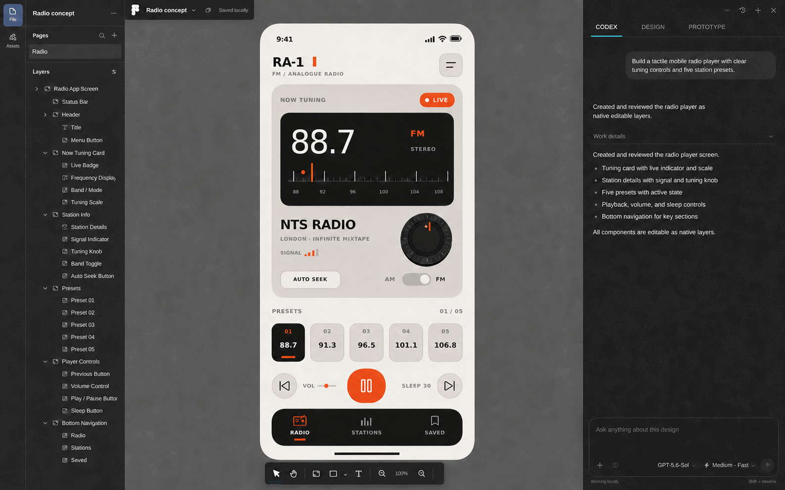

# Figmaboy

**A local-first design editor with Codex chat beside the canvas.**

Draw and style native layers by hand, or ask Codex to work on the open document. Replies, tool calls, and approvals stay in the sidebar. Codex edits use the same undo history and local autosave as manual edits.

[Website](https://0xmiki.github.io/figmaboy/) · [Documentation](https://0xmiki.github.io/figmaboy/docs/) · [Download Figmaboy](https://0xmiki.github.io/figmaboy/download/) · [Changelog](CHANGELOG.md)

[](https://github.com/0xmiki/figmaboy/actions/workflows/ci.yml)
[](https://github.com/0xmiki/figmaboy/releases/latest)
[](LICENSE)



## Download

Choose an installer on the [Figmaboy download page](https://0xmiki.github.io/figmaboy/download/), or browse the files on [GitHub Releases](https://github.com/0xmiki/figmaboy/releases/latest):

- Linux: AppImage, Debian package, and RPM package
- macOS: DMG builds for Apple Silicon and Intel
- Windows: NSIS and MSI installers

Each release includes `SHA256SUMS`. Every desktop build includes the matching Figmaboy design tools used by the built-in Codex tab.

macOS builds are ad hoc signed but not notarized. The first launch may require approval in **System Settings → Privacy & Security**. Windows builds are not code-signed and may show a SmartScreen warning.

## Start with Codex

Install the Codex CLI and sign in once. Open a design, select **Codex** in the right sidebar, and describe the screen or change you want.

Figmaboy supplies its bundled MCP to the built-in chat automatically. Open the Codex tab and start working. There is no MCP setup prompt, registration step, or terminal command.

[Create your first design](https://0xmiki.github.io/figmaboy/docs/getting-started/quickstart/)

## What is new in 0.5

- `/evolve [direction]` runs repeated design passes on one selected frame and shows accepted candidates on the canvas.
- The Codex composer supports inline skills, Markdown, pasted or dropped image references, and prompt copying.
- Frames open in a focused fullscreen preview from the canvas or Layers context menu.
- Design and Codex share one right sidebar, with quieter navigation and faster page transitions.

[Read the 0.5 release notes](https://0xmiki.github.io/figmaboy/docs/reference/release-notes/)

## Projects and designs

The local workspace holds standalone designs and projects. Choose **New project** on the home toolbar, open it, then choose **New design** to add a file. The home screen shows both kinds of work. A project view shows only its files.

Existing standalone designs remain in **Drafts** and do not need to be migrated into a project.

## Codex design MCP

Figmaboy includes a `figmaboy-mcp` stdio server. Codex can read saved designs while the desktop app is closed. With the app open, Codex can edit the current design through normal undo, redo, and autosave.

### Use saved designs as Codex context

Right-click a design card and choose **Copy design ID**. You can also use the copy button beside the file name in the editor. IDs stay the same after a rename, so use them for repeatable work:

> Build the interface from the Figmaboy design `file_…`, page `Home`.

Names work too when they are unique:

> Use the Figmaboy design named `Marketing site` as the visual and layout reference.

The MCP exposes two offline tools:

- `designs_list` searches saved designs and returns their IDs, names, projects, timestamps, and page counts.
- `design_context_get` accepts `fileId` or `fileName` and an optional page ID or name. It returns the latest saved document, ordered layer tree, asset metadata, revision, and preview.

If several designs share a name, the MCP returns their project names and IDs. Codex can then retry with the exact ID. Offline context is read-only. Open the design in Figmaboy before asking Codex to change it.

### Runtime architecture

The desktop app and MCP server are separate processes with two data paths:

```text
Figmaboy chat sidebar
        │ Codex app-server protocol over stdio
        ▼
Codex app-server
        │ MCP over stdio
        ▼
bundled figmaboy-mcp
        ├── read-only SQLite ───────────────► saved pages, layers, previews
        │                                     (app open or closed)
        │
        └── authenticated 127.0.0.1 bridge ─► currently open editor
                                              (live inspect and edit)
```

1. Figmaboy autosaves native page documents and per-page previews to its local SQLite workspace.
2. `figmaboy-mcp` opens that database in SQLite read-only mode for `designs_list` and `design_context_get`. WAL mode keeps reads safe while the app is saving.
3. Figmaboy starts an editor bridge on a random loopback-only port when the desktop app opens.
4. The app writes the port, a random authentication token, and its process ID to `editor-bridge.json` in the local application-data directory. On Unix, mode `0600` restricts the file to the current user.
5. The desktop app starts `codex app-server` on demand and passes the bundled `figmaboy-mcp` path as a process-local configuration override. It does not change `~/.codex/config.toml`.
6. Live tools connect through the bridge. The editor applies and renders each mutation, then returns the result through the same path.

The MCP process never writes to the SQLite database. This keeps validation, undo/redo, live rendering, revision checks, and autosave inside the desktop app.

The default discovery file lives at:

| Platform | Path |
| --- | --- |
| Linux | `${XDG_DATA_HOME:-$HOME/.local/share}/com.miki.figmaboy/editor-bridge.json` |
| macOS | `~/Library/Application Support/com.miki.figmaboy/editor-bridge.json` |
| Windows | `%LOCALAPPDATA%\com.miki.figmaboy\editor-bridge.json` |

Set `FIGMABOY_BRIDGE_FILE` for the MCP process only when a non-default discovery path is required.

Set `FIGMABOY_DB_PATH` to override the saved workspace database path, primarily for portable installations and tests.

### Use the integrated Codex sidebar

Install the Codex CLI and sign in once. Open a design, then select **Codex** in the shared right sidebar. Figmaboy starts the documented `codex app-server` protocol. It does not embed or parse the terminal interface.

Codex stores chat history in a separate local working directory for each design. The sidebar includes model and reasoning controls, saved drafts, image attachments, steering, approvals, context usage, pinned chats, and ChatGPT sign-in.

The composer recognizes `@selection`, `@current-frame`, `@page`, and `@design`. Type `$` to invoke an installed Codex skill or `/` for Figmaboy chat actions such as `/review`, `/evolve`, `/save`, `/compact`, and `/undo`.

Select one frame and run `/evolve [direction]` when you want repeated design passes. Accepted candidates stay on the canvas, rejected candidates restore the current best, and one undo returns to the design from before the run.

### Use Figmaboy from another Codex client

Most people can ignore this. The built-in Codex tab already has every Figmaboy tool it needs.

Install the standalone Figmaboy MCP only if you want Codex CLI or an IDE integration outside Figmaboy to read saved designs or control the design currently open in Figmaboy. See [External Codex clients](https://0xmiki.github.io/figmaboy/docs/getting-started/connect-codex/) for the scope and limitations.

### Tools and authoring contract

Offline tools find saved designs and load a page preview with its native document. Live tools inspect the editor and read exact geometry. They can change layers, place images, control selection and viewport, use history, save, and capture frame screenshots.

Codex builds with native frames, groups, shapes, text, images, and icons. Every visible element remains editable in the layer panel and addressable through MCP. Codex should call `design_capabilities` before it creates a design.

Native styling includes solid and gradient fills, independent corner radii, stroke controls, blend modes, shadows, blur, and full typography controls. Designs should use one top-level frame per screen with named sections and components instead of a flat root layer list.

Right-click a frame and choose **Copy as image** to copy the frame and its children. The renderer targets a 3840 px long edge, uses at least 2× scale for ordinary frames, and stays below the 4096 px limit. On Linux it copies PNG pixels and a cached PNG file URI.

The machine-readable TypeScript contract lives at [`mcp/types.ts`](mcp/types.ts). The `types_get` tool also returns it at runtime. Use `nodes_center` for center alignment, `nodes_set_border_radius` for rounded surfaces, and `frame_screenshot` to review each completed frame.

### Generated artwork

Codex can generate artwork and place the final PNG, JPEG, or WebP with `image_place`. Figmaboy saves the asset as a normal image layer. For a background, pass the containing frame as `parentId`. Set `placement: "fill-parent"`, `fit: "cover"`, and `index: 0`. Use a transparent PNG and explicit dimensions for a logo or cutout. Finish with `frame_screenshot`.

### Development server

Build the MCP binary directly from this checkout:

```console
nix-shell --run 'cargo build --locked --release --manifest-path src-tauri/mcp/Cargo.toml'
```

### Bundled sidecar

Tauri builds include `figmaboy-mcp` as an external binary. Development and release hooks compile it for the selected target and stage it with Tauri's target-triple filename. Prepare and validate the current host binary with:

```console
nix-shell --run 'bun run sidecar:prepare'
nix-shell --run 'bun run sidecar:smoke'
```

Generated sidecar binaries live under `src-tauri/binaries/` and are not committed. `bun run tauri dev` prepares a debug sidecar; production Tauri builds prepare a release sidecar.

## Development

Run `nix-shell`, then `bun run tauri dev`.

## Recommended IDE setup

[VS Code](https://code.visualstudio.com/) + [Svelte](https://marketplace.visualstudio.com/items?itemName=svelte.svelte-vscode) + [Tauri](https://marketplace.visualstudio.com/items?itemName=tauri-apps.tauri-vscode) + [rust-analyzer](https://marketplace.visualstudio.com/items?itemName=rust-lang.rust-analyzer).
