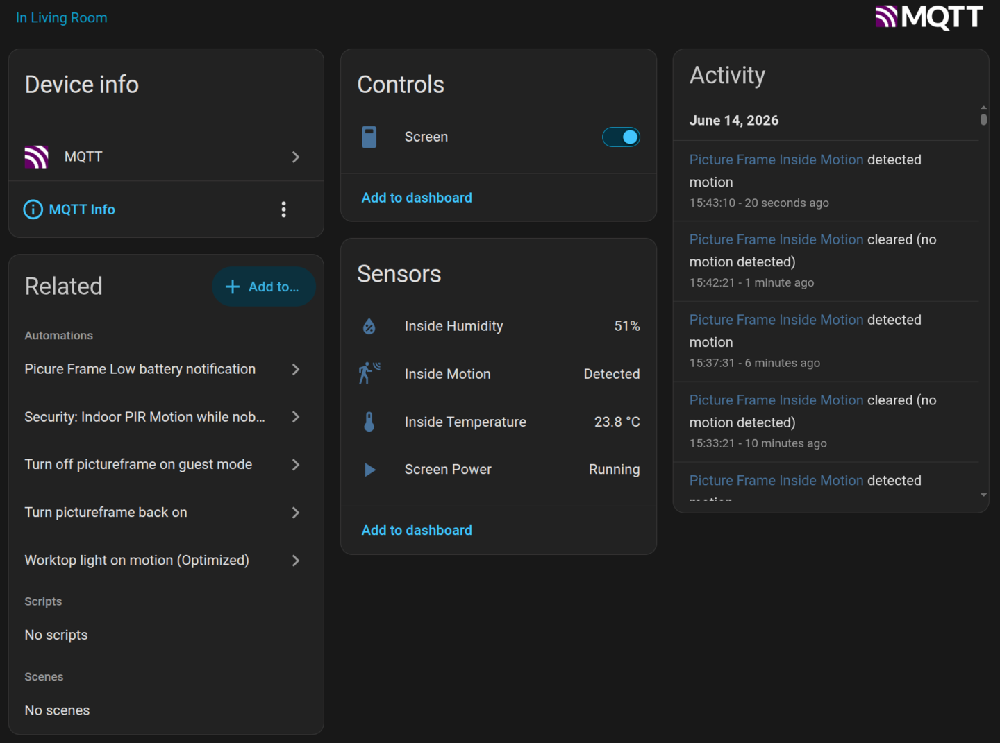

The frame joins Home Assistant as a proper device over MQTT. It publishes its sensor readings
and a screen switch to your broker, and Home Assistant discovers them on its own, with no YAML
to write. Set it up under **Settings → Home Assistant**.

## What you need

- An **MQTT broker** on your network, such as the Mosquitto add-on.
- Home Assistant's **MQTT integration** with discovery enabled, which is the default.
- At least one [Bluetooth sensor](/manual/sensors/) if you want readings. The screen switch is
  published either way.

## Connecting to the broker

Under **Settings → Home Assistant**, fill in the connection:

- **Broker**, as `tcp://` or `ssl://` with a host and port, for example
  `tcp://192.168.1.10:1883`.
- **Client ID**, unique to this frame.
- **Username** and **Password**, if your broker requires them.

This same broker also feeds [MQTT sensors](/manual/sensors/), so it is not tied to Home
Assistant, and readings can come from any source on the broker. Once a broker is set, turn on the
**Home Assistant bridge**.

## What it exposes

With the bridge on, Home Assistant discovers one device, labelled with the Pi's model and the
running frame version, carrying:

- each Bluetooth sensor's readings, temperature and humidity as sensors, motion as a binary
  sensor;
- a **Screen** switch, to turn the panel on or off from Home Assistant;
- a read-only **screen-power** sensor, showing whether the panel is actually lit;
- Raspberry Pi diagnostics: **CPU temperature**, **memory usage**, and **uptime** sensors, plus
  an **undervoltage** problem sensor that flags an inadequate power supply;
- a **last touch** timestamp, updated when someone taps the frame's own screen. Clicks in the
  admin interface don't count.

Only Bluetooth sensors are bridged. Mock sensors are a development aid, and MQTT sensor readings
already come from the broker, so re-publishing them would loop.

:::tip[Showing Home Assistant's own data on the frame]
The bridge sends data to Home Assistant. To go the other way and show a Home Assistant entity
on the frame, enable Home Assistant's
[MQTT Statestream](https://www.home-assistant.io/integrations/mqtt_statestream/) integration so
it publishes entity states to the broker, then read them back as [MQTT sensors](/manual/sensors/).
:::

The switch reflects intent, not the live panel. Motion and idle blanking move the screen-power
sensor but leave the switch alone. Turning the switch on re-enables motion auto-wake. Turning it
off forces the screen off and holds it there. With no motion sensor, it is a plain on-and-off.
See [Slideshow & display](/manual/slideshow-display/).

## Bridge settings

- **Node ID** is the device's identity in Home Assistant, its device id and the prefix for
  every entity. Give each frame a distinct value if you run more than one.
- **Base topic** namespaces the state, command, and availability topics.
- **Discovery prefix** must match Home Assistant's MQTT discovery prefix, `homeassistant` by
  default.
- **Stale after** marks a sensor unavailable in Home Assistant when no reading arrives within
  the window. An entity shows as available only while both the frame and that sensor are online,
  so a dead frame and a silent sensor both surface honestly instead of leaving a stale value
  looking live.

:::note[Restart required]
The broker connection and the bridge settings take effect after the frame restarts.
:::

## Using it

The device appears under **Settings → Devices & services → MQTT** in Home Assistant. From there
you can add its entities to dashboards, or fold them into automations: blank the screen when you
leave, wake it when you are back, or use the frame's motion and climate readings elsewhere in
your home.

Alongside the screen switch and the sensors you configured, the bridge publishes a **last touch**
timestamp, and the frame's own diagnostics: CPU temperature, memory use, uptime, hostname, IP
address, and undervoltage on Pi hardware. Version, model, and board revision appear on the device
card itself.

## Reboot and shutdown

The frame can also expose two buttons that act on the Raspberry Pi itself:

| Button       | What it does                                                                       |
| ------------ | ---------------------------------------------------------------------------------- |
| **Reboot**   | Restarts the whole device. Photos resume once it is back, usually within a minute. |
| **Shutdown** | Powers the device off. It stays off until someone powers it on again.              |

Both are ordinary Home Assistant buttons, so an automation can call them: power the frame down
while you are away, or reboot it on a schedule.

:::caution[Shutdown is one-way]
Nothing on the frame can undo a shutdown. The device stays off until its power is physically
cycled or switched back on. On a PoE switch you can restore power from the switch; otherwise it
means walking over to it.
:::

Home Assistant fires a button the instant it is pressed, with no confirmation. The same two
controls sit on the admin dashboard's System card, where they ask first.

:::note[Installed before version 1.2.3?]
The buttons are published only when the Pi grants the frame permission to reboot and power off,
which software updates alone do not deliver. If they are missing, rerun the install script from
[Install](/getting-started/install/); it keeps your settings and photos.
:::

Every setting on this page maps to a key in the [configuration reference](/reference/configuration/).
