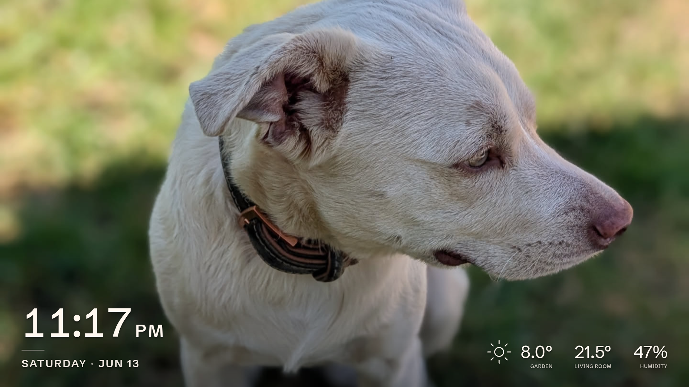

The kiosk is what the frame shows on its own screen: a photo filling the display, with the time,
date, and your room readings along the bottom. There is nothing to configure here. Everything on
the screen is driven by the settings elsewhere in this manual, and the frame shows the
result.

## What is on screen

**The photo.** The current slideshow image fills the screen and advances on the interval you
set. Manage the photos on [Photos](/manual/photos/), and set the timing and order on
[Slideshow & display](/manual/slideshow-display/). With no photos added yet, the screen shows
just the clock and date.

**The clock and date.** The time sits large in the corner, with the weekday and date beneath it,
formatted for the language you chose, in 12- or 24-hour style, and in the time zone you set. You
can also hide the clock and date entirely. Set all of this under
[Slideshow & display](/manual/slideshow-display/).

**The readings.** Along the bottom the frame shows, when each one is available, the outside
reading, the inside reading, and the humidity, each under the caption you gave it:

- the **outside** reading comes from an outside temperature [sensor](/manual/sensors/), or from
  [weather](/manual/weather/) when no such sensor is set, and the weather icon appears when weather
  is on;
- the **inside** temperature and **humidity** come from the matching inside sensors.

A reading shows only when its source is configured, and one that has stopped arriving falls back
to `--`. When nothing is left to show, no readings, no weather, and the clock and date hidden, the
whole bottom overlay disappears and the photo fills the screen on its own.

The clock, date, and readings drift slowly around a small circle, a step each minute and a full
turn each hour. Each step is about a pixel, too small to notice, and over an hour it keeps an
OLED panel from wearing the same bright edges into one spot. LCD panels do not need this, but it
costs them nothing. There is no setting for it.

## Touching the screen

Touch the left half of the screen for the previous photo, the right half for the next. Either one
restarts the timer, so the new photo gets a full interval before the slideshow moves on.

Photos change with the usual crossfade, so a touch takes a few seconds to settle. Touches during
the fade do nothing.

Touching a dark screen lights it up again on the same photo. That holds whether the screen went
dark by itself when the room emptied or you switched it off from the [Dashboard](/manual/dashboard/)
or [Home Assistant](/manual/home-assistant/). Switching it back on this way also restores the
motion wake.

A touch that changes the photo or wakes the screen updates the **last touch** sensor in
[Home Assistant](/manual/home-assistant/#what-it-exposes). Touches during a fade do not.

## When the screen sleeps

With a motion sensor, the frame turns the screen off when the room empties and wakes it when you
return. See [Slideshow & display](/manual/slideshow-display/). You can also switch it on or off
by hand from the [Dashboard](/manual/dashboard/) or [Home Assistant](/manual/home-assistant/).
