# SvelteForge - SvelteKit Admin Dashboard Template

A production-ready admin dashboard template built with **SvelteKit 2**, **Svelte 5**, **Tailwind CSS 4**, and **Drizzle ORM**. Features custom session-based authentication, optional OAuth (Google & GitHub), role-based access control, and a full suite of admin tools -- all with zero external auth dependencies.


> **⚡ Need workspaces, billing, AI chat, kanban, helpdesk, CRM, invoicing, MFA + passkeys?**
>
> [**SvelteForge Premium →**](https://dashboardpack.com/theme-details/svelteforge-premium/?utm_source=github&utm_medium=readme&utm_content=top-banner&utm_campaign=upgrade-svelteforge-premium) — same stack, plus 30+ wired-up modules, multi-tenant from row zero. **[Live demo →](https://svelteforge-pro.dashboardpack.com/?utm_source=github&utm_medium=readme&utm_content=top-banner-demo&utm_campaign=upgrade-svelteforge-premium)** · [See feature comparison ↓](#free-vs-premium)

<p align="center">
  <a href="https://dashboardpack.com/theme-details/svelteforge-premium/?utm_source=github&utm_medium=readme&utm_content=top-badge&utm_campaign=upgrade-svelteforge-premium">
    
  </a>
  <a href="https://svelteforge-pro.dashboardpack.com/?utm_source=github&utm_medium=readme&utm_content=top-badge-demo&utm_campaign=upgrade-svelteforge-premium">
    
  </a>
</p>

## Screenshots

<table>
  <tr>
    <td align="center"><strong>Dashboard (Light)</strong></td>
    <td align="center"><strong>Dashboard (Dark)</strong></td>
  </tr>
  <tr>
    <td>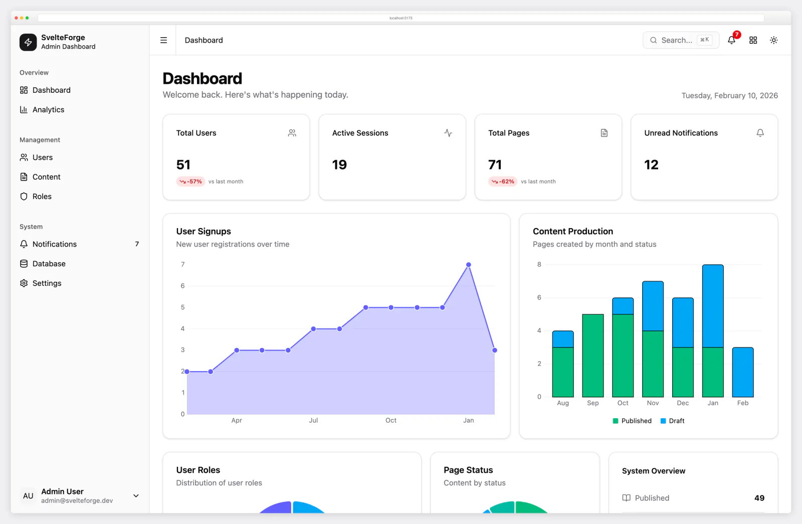</td>
    <td>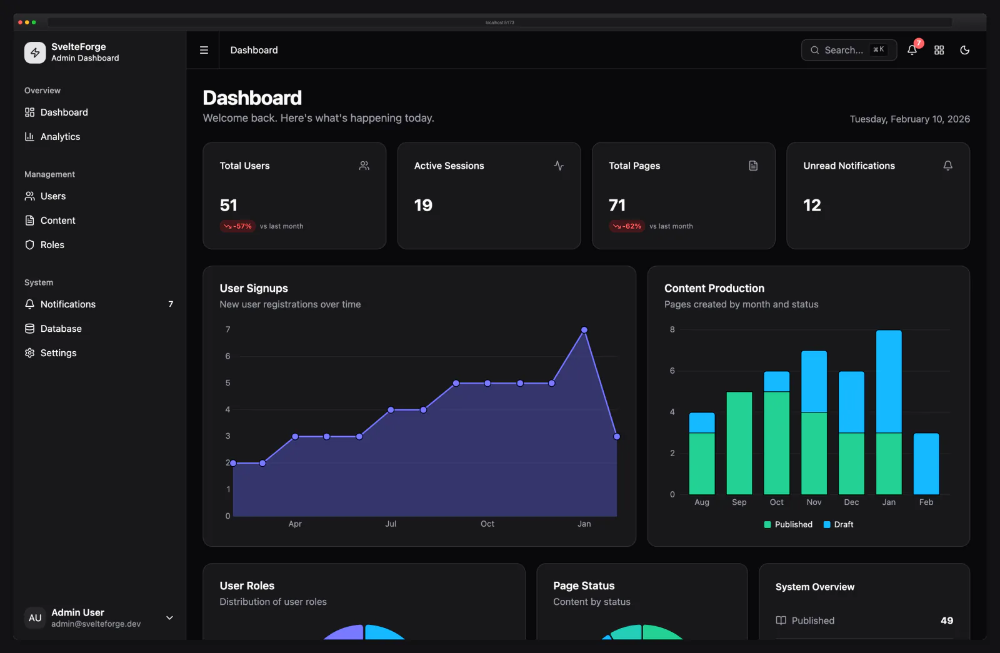</td>
  </tr>
  <tr>
    <td align="center"><strong>User Management</strong></td>
    <td align="center"><strong>Analytics</strong></td>
  </tr>
  <tr>
    <td>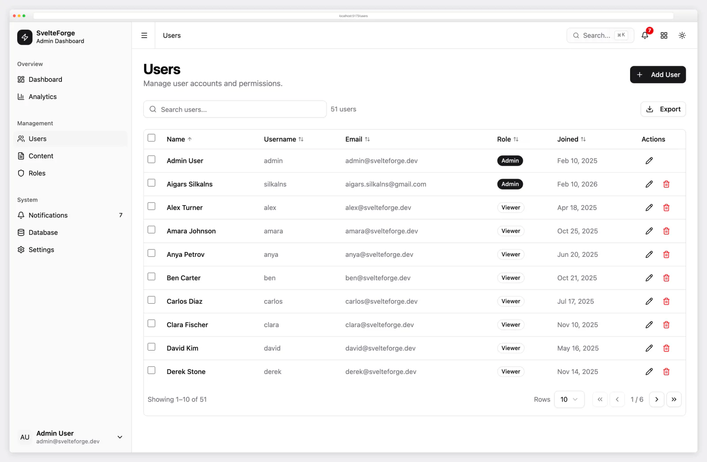</td>
    <td>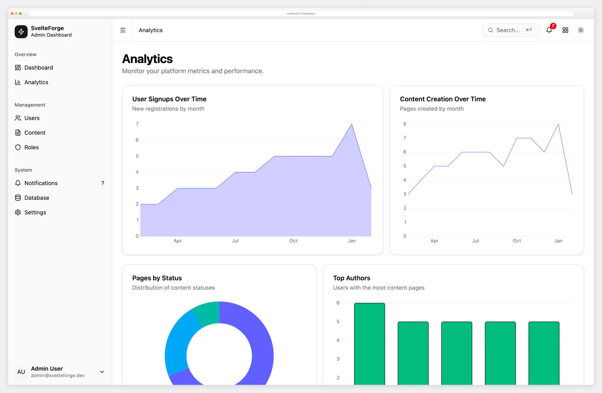</td>
  </tr>
  <tr>
    <td align="center"><strong>Command Palette (Cmd+K)</strong></td>
    <td align="center"><strong>Login</strong></td>
  </tr>
  <tr>
    <td>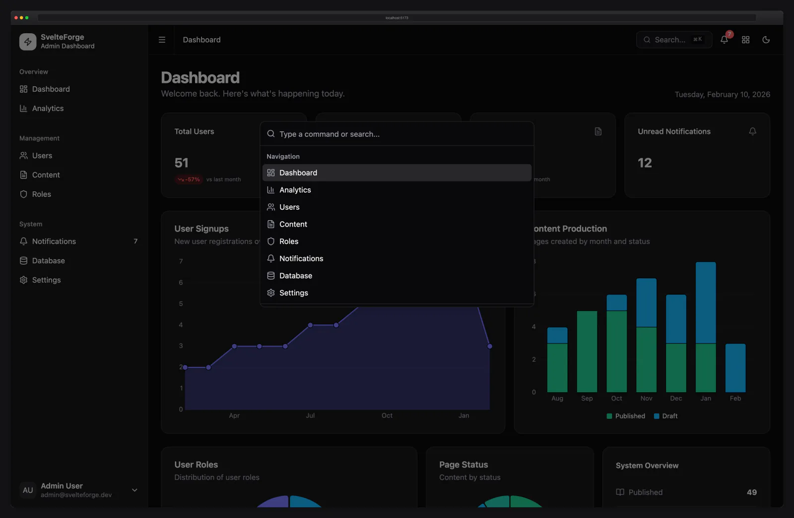</td>
    <td>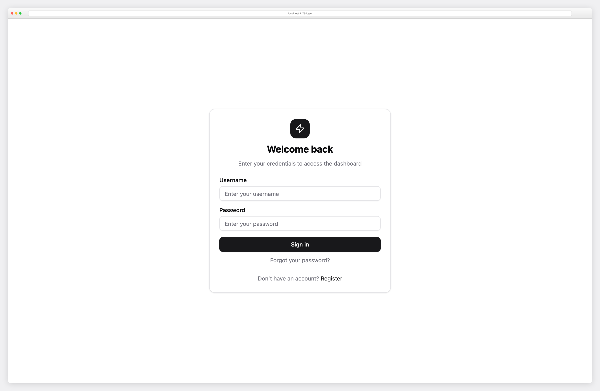</td>
  </tr>
</table>

---

## Free vs Premium

SvelteForge (this repo) is the open-source core — pure SvelteKit + Drizzle + custom session auth, MIT-licensed, free forever. **SvelteForge Premium** clones this codebase and adds a multi-tenant SaaS layer on top: workspaces, billing, MFA + passkeys, AI chat, CRM, helpdesk, invoicing, and 30+ other production-ready modules.

| Capability                                                                      | **Free** (this repo) | **[Premium →](https://dashboardpack.com/theme-details/svelteforge-premium/?utm_source=github&utm_medium=readme&utm_content=comparison-table-header&utm_campaign=upgrade-svelteforge-premium)** |
| ------------------------------------------------------------------------------- | :------------------: | :--------------------------------------------------------------------------------------------------------------------------------------------------------------------------------------------: |
| **Auth** — username/email + password, Google + GitHub OAuth, sessions, Argon2id |          ✅          |                                                                                               ✅                                                                                               |
| **Magic-link sign-in**                                                          |          —           |                                                                                               ✅                                                                                               |
| **TOTP 2FA + recovery codes**                                                   |          —           |                                                                                               ✅                                                                                               |
| **WebAuthn passkeys**                                                           |          —           |                                                                                               ✅                                                                                               |
| **User impersonation** ("sign in as")                                           |          —           |                                                                                               ✅                                                                                               |
| **Multi-tenant workspaces** + org switcher + member roster + invitations        |          —           |                                                                                               ✅                                                                                               |
| **Custom roles** + permission catalogue                                         |          —           |                                                                                               ✅                                                                                               |
| **Billing** — Stripe + Polar (env-switched), webhooks, customer portal          |          —           |                                                                                               ✅                                                                                               |
| **Per-org usage metering** + quota dashboards                                   |          —           |                                                                                               ✅                                                                                               |
| **Inbox** — multi-folder mail client with threads, snooze, scheduled send       |          —           |                                                                                               ✅                                                                                               |
| **Team Chat** — real-time SSE, presence, typing, mentions, reactions            |          —           |                                                                                               ✅                                                                                               |
| **Calendar** — month + week views, color tagging                                |          —           |                                                                                               ✅                                                                                               |
| **Kanban** — drag-drop boards, columns, due dates                               |          —           |                                                                                               ✅                                                                                               |
| **Notes / Wiki** — workspace markdown with folder tree                          |          —           |                                                                                               ✅                                                                                               |
| **Projects + tasks** — Gantt timeline, status, priority                         |          —           |                                                                                               ✅                                                                                               |
| **Files** — S3-compatible storage (AWS S3, R2, MinIO, B2)                       |          —           |                                                                                               ✅                                                                                               |
| **AI Chat** — Anthropic Claude with prompt caching + tool use                   |          —           |                                                                                               ✅                                                                                               |
| **CRM** — contacts directory, drag-to-stage deals, CSV import                   |          —           |                                                                                               ✅                                                                                               |
| **Helpdesk** — ticket queue with SLA stamps, threaded replies                   |          —           |                                                                                               ✅                                                                                               |
| **Store** — products + orders with line-item snapshots                          |          —           |                                                                                               ✅                                                                                               |
| **Invoicing** — line-item editor, PDF, recurring schedules, customer portal     |          —           |                                                                                               ✅                                                                                               |
| **Forms builder** — drag-drop with conditional logic + rate-limited submit      |          —           |                                                                                               ✅                                                                                               |
| **Status page** — public services + incidents + email subscribers               |          —           |                                                                                               ✅                                                                                               |
| **Audit log** — saved-filter chips + CSV export                                 |          —           |                                                                                               ✅                                                                                               |
| **API keys** — prefix + hash storage, scopes, IP allowlist, per-key rate limit  |          —           |                                                                                               ✅                                                                                               |
| **Outgoing webhooks** — HMAC-signed, retries, delivery history                  |          —           |                                                                                               ✅                                                                                               |
| **REST API** at `/api/v1` — OpenAPI 3.1 spec + Postman collection               |          —           |                                                                                               ✅                                                                                               |
| **Cron suite** — 6 recurring endpoints (bearer-token auth)                      |          —           |                                                                                               ✅                                                                                               |
| **Slack/Discord notification channels** — fan-out keyed by audit events         |          —           |                                                                                               ✅                                                                                               |
| **Scheduled CSV reports** — emailed daily/weekly/monthly                        |          —           |                                                                                               ✅                                                                                               |
| **Referrals** — codes, attribution, commission accrual                          |          —           |                                                                                               ✅                                                                                               |
| **Customisable My Dashboard** — drag-reorder widget grid                        |          —           |                                                                                               ✅                                                                                               |
| **Onboarding wizard** + product tour primitive                                  |          —           |                                                                                               ✅                                                                                               |
| **Theme customizer** — brand color + typography picker                          |          —           |                                                                                               ✅                                                                                               |
| **Form wizard** + **Data table** + **CSV importer** components                  |          —           |                                                                                               ✅                                                                                               |
| **Email** — Resend + Cloudflare Email Sending adapters (free has console only)  |    console (dev)     |                                                                                     + Resend + Cloudflare                                                                                      |
| **Documentation** — `/docs` developer reference                                 |       16 pages       |                                                                                            16 pages                                                                                            |
| **User guide** at `/guide` — workspaces, billing, AI, every premium app         |          —           |                                                                                          30+ chapters                                                                                          |
| **Database tables**                                                             |          7           |                                                                                       7 + **49 premium**                                                                                       |
| **Demo seeder** — Acme workspace + 30 tenant orgs for SaaS analytics            |          —           |                                                                                               ✅                                                                                               |
| **License**                                                                     |         MIT          |                                                                                           Commercial                                                                                           |
| **Pricing**                                                                     |     Free forever     |                                                                                       $69 / $149 / $349                                                                                        |

[**▶ Try the live Premium demo →**](https://svelteforge-pro.dashboardpack.com/?utm_source=github&utm_medium=readme&utm_content=comparison-table-footer&utm_campaign=upgrade-svelteforge-premium) (sign in with `admin` / `password123` · seeded with realistic data across every module)

## More Svelte dashboards from DashboardPack

Building on Svelte? **[Apex Dashboard — Svelte Edition](https://dashboardpack.com/theme-details/apex-dashboard-svelte/?utm_source=github&utm_medium=readme&utm_content=apex-svelte-intro&utm_campaign=svelteforge)** is our flagship premium SvelteKit template — the **same Svelte 5 + Tailwind CSS v4 stack as this repo**, with a completely different design system and 36 production-ready pages. If SvelteForge got you shipping, Apex takes the polish further.

<p align="center">
  <a href="https://dashboardpack.com/theme-details/apex-dashboard-svelte/?utm_source=github&utm_medium=readme&utm_content=apex-svelte-featured&utm_campaign=svelteforge">
    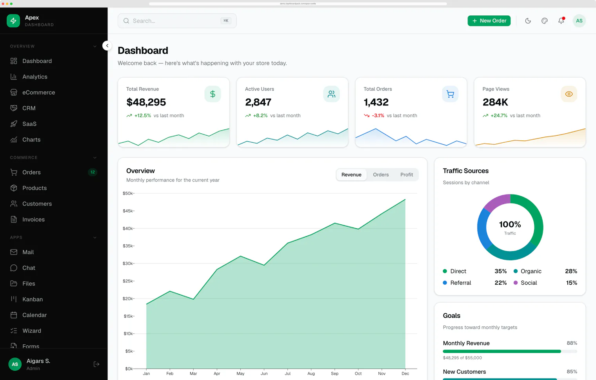
  </a>
</p>

<p align="center">
  <strong>Apex Dashboard — Svelte Edition</strong><br>
  <sub>SvelteKit 2 + Svelte 5 (runes) + Tailwind CSS v4 · 36 pages · 6 dashboards · ⌘K command palette · LayerChart data viz · live theme customizer · runtime i18n (en/de/fr) · drag-and-drop Kanban · Storybook component library.</sub>
</p>

<p align="center">
  <a href="https://dashboardpack.com/theme-details/apex-dashboard-svelte/?utm_source=github&utm_medium=readme&utm_content=apex-svelte-details&utm_campaign=svelteforge"><strong>View Apex Svelte →</strong></a>
  &nbsp;·&nbsp;
  <a href="https://demo.dashboardpack.com/apex-svelte/?utm_source=github&utm_medium=readme&utm_content=apex-svelte-demo&utm_campaign=svelteforge"><strong>▶ Live demo</strong></a>
  &nbsp;·&nbsp;
  <a href="https://dashboardpack.com/templates/svelte/?utm_source=github&utm_medium=readme&utm_content=svelte-category&utm_campaign=svelteforge"><strong>Browse all Svelte templates →</strong></a>
</p>

More Svelte & SvelteKit templates land on the **[DashboardPack Svelte category](https://dashboardpack.com/templates/svelte/?utm_source=github&utm_medium=readme&utm_content=svelte-category-text&utm_campaign=svelteforge)** as we build them — bookmark it to catch new releases.

### Prefer another stack?

Loved SvelteForge but need it in another framework? Check out our premium templates on [DashboardPack](https://dashboardpack.com/?utm_source=github&utm_medium=readme&utm_content=other-templates&utm_campaign=svelteforge) -- built for production, backed by dedicated support.

<table>
  <tr>
    <td align="center" width="33%">
      <a href="https://dashboardpack.com/theme-details/zenith-nextjs/?utm_source=github&utm_medium=readme&utm_campaign=svelteforge">
        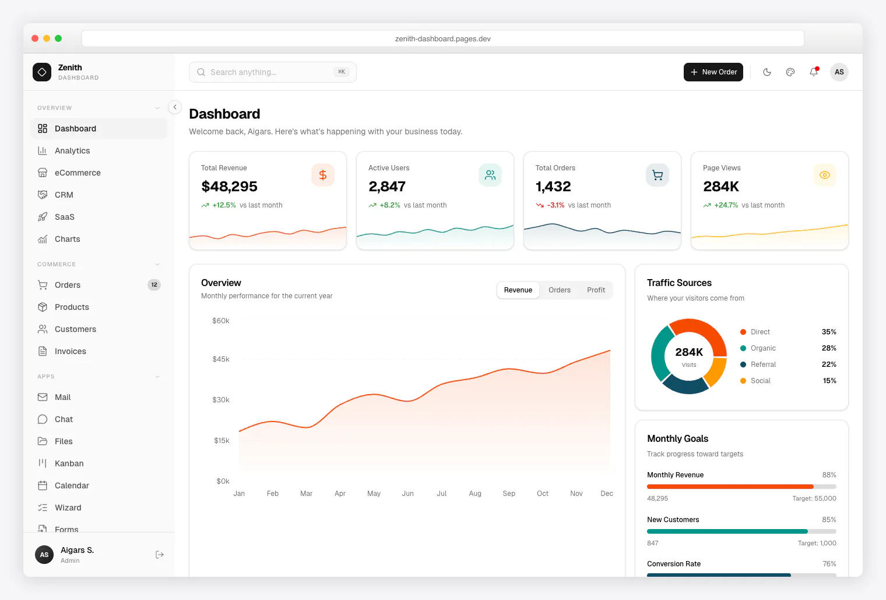
      </a>
      <br>
      <a href="https://dashboardpack.com/theme-details/zenith-nextjs/?utm_source=github&utm_medium=readme&utm_campaign=svelteforge"><strong>Zenith</strong></a>
      <br>
      <sub>Next.js 16 + React 19 + Tailwind CSS v4. Achromatic design, drag-and-drop, i18n, RTL support.</sub>
    </td>
    <td align="center" width="33%">
      <a href="https://dashboardpack.com/theme-details/signal-nextjs/?utm_source=github&utm_medium=readme&utm_campaign=svelteforge">
        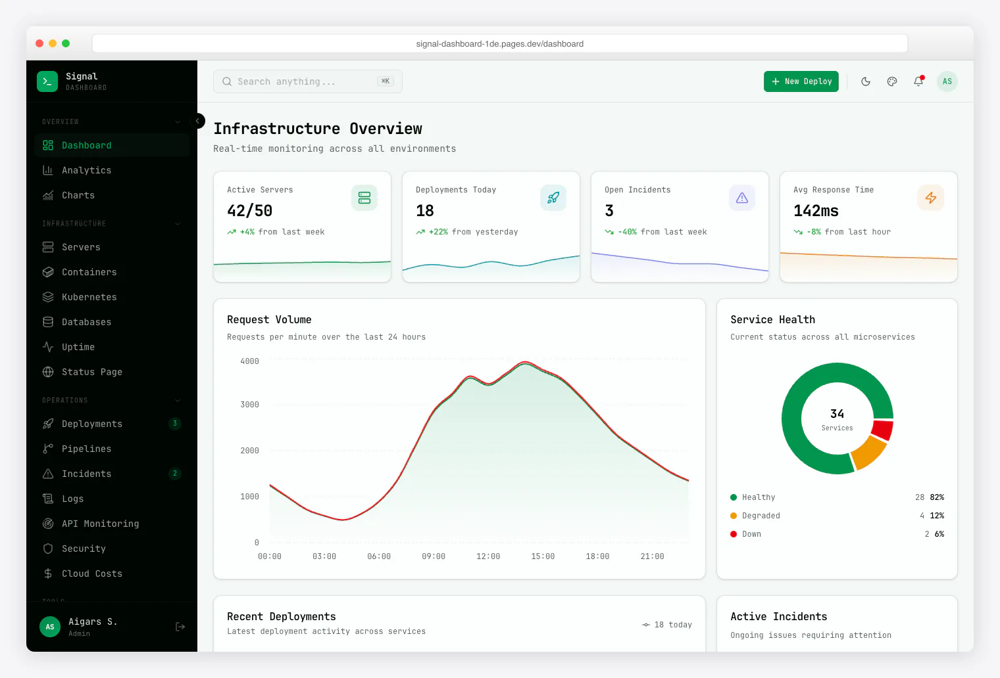
      </a>
      <br>
      <a href="https://dashboardpack.com/theme-details/signal-nextjs/?utm_source=github&utm_medium=readme&utm_campaign=svelteforge"><strong>Signal</strong></a>
      <br>
      <sub>Next.js 16 + React 19 + Tailwind CSS v4. 10 chart types, Storybook, 3 layout options.</sub>
    </td>
  </tr>
  <tr>
    <td align="center" width="33%">
      <a href="https://dashboardpack.com/theme-details/ember-nextjs/?utm_source=github&utm_medium=readme&utm_campaign=svelteforge">
        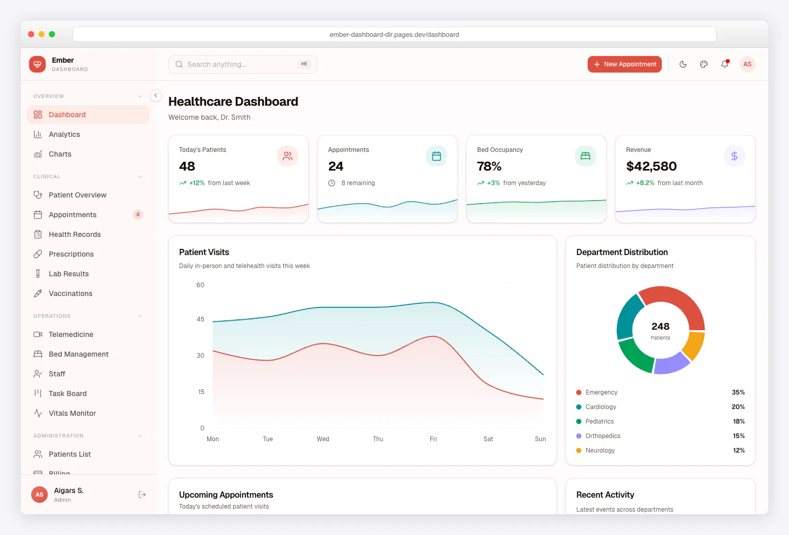
      </a>
      <br>
      <a href="https://dashboardpack.com/theme-details/ember-nextjs/?utm_source=github&utm_medium=readme&utm_campaign=svelteforge"><strong>Ember</strong></a>
      <br>
      <sub>Next.js 16 + React 19 + Tailwind CSS v4. Clean minimal design, Kanban, Calendar, Chat.</sub>
    </td>
    <td align="center" width="33%">
      <a href="https://dashboardpack.com/theme-details/flux-nextjs/?utm_source=github&utm_medium=readme&utm_campaign=svelteforge">
        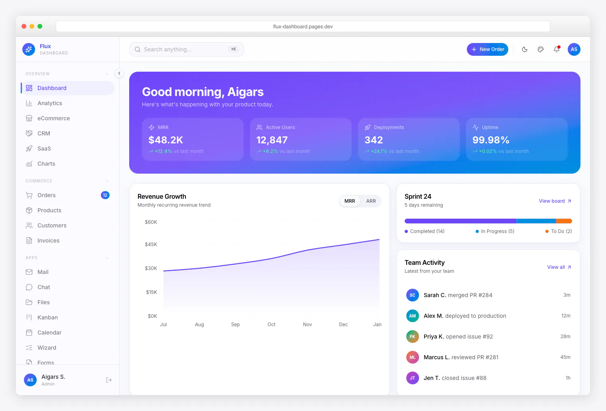
      </a>
      <br>
      <a href="https://dashboardpack.com/theme-details/flux-nextjs/?utm_source=github&utm_medium=readme&utm_campaign=svelteforge"><strong>Flux</strong></a>
      <br>
      <sub>Next.js 16 + React 19 + Tailwind CSS v4. Gradient design, frosted glass UI, startup-native data.</sub>
    </td>
    <td align="center" width="33%">
      <a href="https://dashboardpack.com/theme-details/admindek-html/?utm_source=github&utm_medium=readme&utm_campaign=svelteforge">
        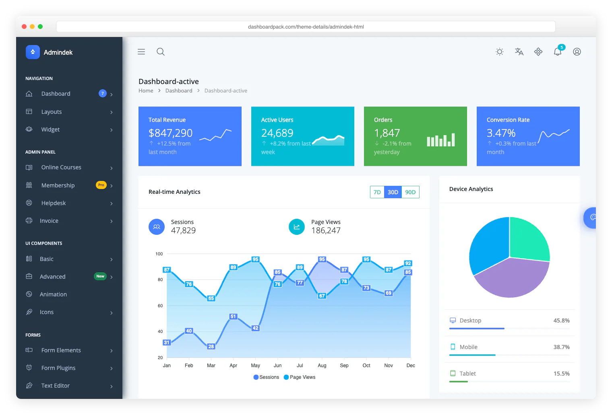
      </a>
      <br>
      <a href="https://dashboardpack.com/theme-details/admindek-html/?utm_source=github&utm_medium=readme&utm_campaign=svelteforge"><strong>Admindek</strong></a>
      <br>
      <sub>Bootstrap 5 + vanilla JS. 100+ components, theme customizer, RTL, 10 color palettes.</sub>
    </td>
  </tr>
</table>

<p align="center">
  <a href="https://dashboardpack.com/?utm_source=github&utm_medium=readme&utm_content=other-templates-footer&utm_campaign=svelteforge"><strong>Browse All Premium Templates on DashboardPack</strong></a>
</p>

---

## Tech Stack

| Layer         | Technology                                                   |
| ------------- | ------------------------------------------------------------ |
| **Framework** | SvelteKit 2.68 + Svelte 5 (runes API)                        |
| **Styling**   | Tailwind CSS 4 + shadcn-svelte                               |
| **Database**  | SQLite via Drizzle ORM + better-sqlite3 (WAL mode)           |
| **Auth**      | Custom sessions (@oslojs/crypto) + Argon2id password hashing |
| **OAuth**     | Arctic (Google + GitHub) -- optional, environment-driven     |
| **Charts**    | LayerChart v2 (D3-based)                                     |
| **Testing**   | Vitest (unit) + Playwright (E2E)                             |
| **Linting**   | ESLint 10 + Prettier                                         |

---

## Features

### Authentication & Security

- **Custom session management** -- SHA-256 hashed tokens stored in the database. Raw token in HttpOnly cookie, hash in DB. If your database leaks, session tokens cannot be recovered.
- **Argon2id password hashing** -- Industry-standard password hashing with configurable memory/time cost parameters.
- **Auto-extending sessions** -- Sessions automatically refresh when less than 15 days remain (30-day lifetime).
- **Session metadata** -- User agent and IP address tracked per session for security auditing.
- **OAuth login (optional)** -- Google and GitHub social login via Arctic. Providers only activate when you set credentials in `.env`. No credentials = password-only login, no errors.
- **Password reset flow** -- Forgot password page with token-based reset (token hashed in DB).
- **Screen lock** -- Lock screen that requires re-entering your password.

### Role-Based Access Control (RBAC)

Three built-in roles with different permission levels:

| Role       | Capabilities                                                                    |
| ---------- | ------------------------------------------------------------------------------- |
| **Admin**  | Full access -- manage users, change roles, delete accounts, access all settings |
| **Editor** | Create and manage content, view analytics and notifications                     |
| **Viewer** | Read-only access to dashboard and content                                       |

- First registered user automatically gets the `admin` role.
- Admins can promote/demote users between roles.
- Role-change confirmation dialogs prevent accidental modifications.

### Dashboard

- **KPI cards** -- Total users, active sessions, published pages, and unread notifications with change indicators.
- **Interactive charts** -- Area charts (user registrations over time), bar charts (content by status), pie/donut charts (users by role) powered by LayerChart v2.
- **Recent activity feed** -- Latest user registrations and content updates.
- **Animated counters** -- Dashboard numbers animate from zero on load with easeOutExpo easing.

### User Management

- **Full CRUD operations** -- Create, view, edit, and delete users.
- **Server-side data table** -- Sortable columns, search filtering, pagination with configurable page sizes.
- **Bulk actions** -- Delete confirmation dialogs with clear warnings.
- **User creation dialog** -- Admin-only form to create new users with role assignment.
- **Export** -- Download user data as CSV or JSON.

### Content Management (CMS)

- **Page editor** -- Create and edit pages with title, slug, content, and template selection.
- **Templates** -- Default, Landing, and Blog page templates.
- **Publishing workflow** -- Draft / Published / Archived status transitions.
- **Auto-generated slugs** -- Slugs generated from titles, editable before save.
- **Content table** -- Filterable by status, sortable, with pagination.
- **Export** -- Download content data as CSV or JSON.

### Analytics

- **User growth charts** -- Line/area charts showing registration trends over time.
- **Content breakdown** -- Bar and pie charts showing content distribution by status and template.
- **Session analytics** -- Active session counts and trends.
- **Notification metrics** -- Read vs. unread notification ratios.
- **Tabbed interface** -- Separate tabs for Users, Content, Sessions, and Notifications analytics.

### Notifications

- **In-app notification system** -- Info, warning, error, and success notification types.
- **Notification bell** -- Real-time unread count badge in the top navigation bar.
- **Notification popover** -- Quick preview of recent notifications without leaving the current page.
- **Full notifications page** -- View all notifications with mark-as-read and delete actions.
- **Bulk operations** -- Mark all as read, delete all read notifications.

### Role Management

- **Role overview** -- View all roles with member counts and permission summaries.
- **Role-change dialogs** -- Confirmation dialogs when changing user roles.
- **Permission matrix** -- Visual display of what each role can do.

### Database Management

- **Table browser** -- View all database tables with row counts.
- **Schema viewer** -- Inspect table schemas including column names, types, and constraints.
- **Data export** -- Export any table's data as CSV or JSON.
- **Admin-only access** -- Database management restricted to admin role.

### Settings

- **Profile settings** -- Update display name, email, and avatar URL.
- **Password change** -- Change password with current password verification.
- **Session management** -- View all active sessions with device info, IP addresses, and last activity. Revoke individual sessions or all other sessions.
- **App settings** -- Configurable application-level settings stored in the database.
- **Appearance** -- Dark/light mode toggle with system preference detection (persisted via mode-watcher).

### Additional Features

- **Command palette (Cmd+K)** -- Keyboard-driven command palette with navigation, live search, and quick actions (toggle theme, create page).
- **Page view transitions** -- Smooth cross-fade between pages via the View Transitions API.
- **Responsive design** -- Fully responsive layout with collapsible sidebar on mobile.
- **Dark/light mode** -- System-aware theme with manual toggle, persisted across sessions.
- **Breadcrumb navigation** -- Auto-generated breadcrumbs from URL pathname.
- **Apps menu** -- Quick-access grid menu for jumping between sections.
- **Toast notifications** -- Svelte Sonner for action feedback (success, error, info).
- **SEO ready** -- OpenGraph and Twitter meta tags via svelte-meta-tags.
- **Sitemap** -- Auto-generated XML sitemap endpoint.
- **Error page** -- Custom error page with navigation back to safety.
- **Data table pagination** -- Reusable pagination component with page size selector.

---

## Quick Start

### Prerequisites

- **Node.js** 18+ (20+ recommended)
- **pnpm** (install via `npm install -g pnpm`)

### Installation

```bash
# Clone the repository
git clone https://github.com/colorlibhq/svelteforge-admin.git
cd svelteforge-admin

# Install dependencies
pnpm install

# Push database schema (creates SQLite database)
pnpm db:push

# Seed the database with sample data (optional)
pnpm db:seed

# Start the development server
pnpm dev
```

The app will be running at `http://localhost:5173`.

### Default Login

After seeding, you can log in with:

| Username | Password      | Role   |
| -------- | ------------- | ------ |
| `admin`  | `password123` | Admin  |
| `editor` | `password123` | Editor |
| `viewer` | `password123` | Viewer |

> **Note:** If you skip seeding, the first user to register will automatically be assigned the `admin` role.

---

## OAuth Setup (Optional)

Social login is entirely optional. When no OAuth credentials are configured, the login page shows only the username/password form -- no errors, no broken buttons.

### Google

1. Go to [Google Cloud Console](https://console.cloud.google.com/apis/credentials)
2. Create a new OAuth 2.0 Client ID
3. Set the authorized redirect URI to: `http://localhost:5173/login/google/callback`
4. Add your credentials to `.env`:

```env
GOOGLE_CLIENT_ID=your-client-id
GOOGLE_CLIENT_SECRET=your-client-secret
```

### GitHub

1. Go to [GitHub Developer Settings](https://github.com/settings/developers)
2. Create a new OAuth App
3. Set the authorization callback URL to: `http://localhost:5173/login/github/callback`
4. Add your credentials to `.env`:

```env
GITHUB_CLIENT_ID=your-client-id
GITHUB_CLIENT_SECRET=your-client-secret
```

### Production

For production, update the `ORIGIN` environment variable to match your deployed URL:

```env
ORIGIN=https://yourdomain.com
```

Redirect URIs in your OAuth apps must also be updated to use the production URL.

---

## Commands

```bash
# Development
pnpm dev              # Start dev server (http://localhost:5173)
pnpm build            # Production build
pnpm preview          # Preview production build

# Type Checking
pnpm check            # Type-check with svelte-check
pnpm check:watch      # Type-check in watch mode

# Database
pnpm db:push          # Push schema changes to database
pnpm db:generate      # Generate Drizzle migrations
pnpm db:studio        # Open Drizzle Studio GUI
pnpm db:seed          # Seed database with sample data

# Testing
pnpm test             # Run unit tests (Vitest)
pnpm test:watch       # Run tests in watch mode
pnpm test:e2e         # Run E2E tests (Playwright)

# Code Quality
pnpm lint             # Run ESLint
pnpm format           # Format code with Prettier
pnpm format:check     # Check formatting without writing
```

---

## Project Structure

```text
src/
├── app.css                          # Tailwind CSS 4 theme (OKLCH colors)
├── app.d.ts                         # TypeScript type definitions
├── hooks.server.ts                  # Session validation on every request
├── lib/
│   ├── assets/                      # Static assets (favicon)
│   ├── components/
│   │   ├── ui/                      # shadcn-svelte components
│   │   ├── animated-counter.svelte   # Animated number counter (KPI cards)
│   │   ├── app-sidebar.svelte       # Main navigation sidebar
│   │   ├── apps-menu.svelte         # Quick-access grid menu
│   │   ├── command-palette.svelte   # Cmd+K command palette
│   │   ├── data-table-pagination.svelte
│   │   ├── delete-confirm-dialog.svelte
│   │   ├── notification-bell.svelte # Notification badge + popover
│   │   ├── role-change-dialog.svelte
│   │   ├── theme-toggle.svelte      # Dark/light mode toggle
│   │   └── user-form-dialog.svelte  # Create/edit user form
│   ├── hooks/                       # Svelte 5 reactive utilities
│   ├── server/
│   │   ├── auth.ts                  # Session management (token gen, validation)
│   │   ├── db/
│   │   │   ├── index.ts             # Database connection (WAL mode)
│   │   │   ├── schema.ts            # Drizzle schema (users, sessions, pages, etc.)
│   │   │   ├── seed.ts              # Database seeder
│   │   │   └── test-utils.ts        # Test database utilities
│   │   ├── id.ts                    # Crypto ID generator
│   │   └── oauth.ts                 # Arctic OAuth providers (Google, GitHub)
│   └── utils/
│       ├── export.ts                # CSV/JSON export utilities
│       └── user-agent.ts            # User agent parser
├── routes/
│   ├── (app)/                       # Protected routes (auth required)
│   │   ├── +layout.server.ts        # Auth guard + sidebar data
│   │   ├── +layout.svelte           # App shell (sidebar + topbar)
│   │   ├── +page.svelte             # Dashboard
│   │   ├── analytics/               # Charts and metrics
│   │   ├── content/                 # CMS (pages CRUD)
│   │   ├── database/                # Database browser
│   │   ├── notifications/           # Notification center
│   │   ├── roles/                   # Role management
│   │   ├── settings/                # Profile, password, sessions, app settings
│   │   └── users/                   # User management
│   ├── (auth)/                      # Public auth routes
│   │   ├── forgot-password/
│   │   ├── lock/
│   │   ├── login/                   # Login + OAuth routes
│   │   ├── register/
│   │   └── reset-password/
│   ├── (public)/                    # Public pages
│   │   └── pricing/
│   ├── api/                         # API endpoints
│   └── sitemap.xml/                 # Auto-generated sitemap
```

---

## Database Schema

| Table                   | Description                                                            |
| ----------------------- | ---------------------------------------------------------------------- |
| `users`                 | User accounts (id, email, username, password hash, name, avatar, role) |
| `sessions`              | Active sessions (hashed token ID, user agent, IP, expiry)              |
| `pages`                 | CMS content (title, slug, content, template, status, author)           |
| `notifications`         | In-app notifications (title, message, type, read status)               |
| `password_reset_tokens` | Time-limited password reset tokens (hashed)                            |
| `oauth_accounts`        | OAuth provider links (Google, GitHub to user mapping)                  |
| `app_settings`          | Key-value application settings                                         |

---

## Deployment

### Requirements

SvelteForge Admin uses **SQLite** with the `better-sqlite3` native module. Your hosting environment must support:

- **Node.js runtime** (not edge/serverless)
- **Native module compilation** (better-sqlite3)
- **Persistent filesystem** (for the SQLite database file)

### Recommended Hosting

| Provider                        | Tier                | Notes                                |
| ------------------------------- | ------------------- | ------------------------------------ |
| **Railway**                     | Free tier available | One-click deploy, persistent volumes |
| **Fly.io**                      | Free tier available | Global edge, persistent volumes      |
| **Render**                      | Free tier available | Auto-deploy from GitHub              |
| **VPS** (DigitalOcean, Hetzner) | From ~$4/mo         | Full control, Docker-friendly        |

### Not Compatible

- **Cloudflare Pages/Workers** -- V8 isolates cannot run native Node modules (better-sqlite3)
- **Vercel Edge** -- Same limitation as Cloudflare
- **AWS Lambda** -- No persistent filesystem for SQLite

### Docker

A `Dockerfile` is included for containerized deployments:

```bash
docker build -t svelteforge-admin .
docker run -p 3000:3000 -v ./data:/app/data svelteforge-admin
```

### Environment Variables

```env
# Required
DATABASE_URL=svelteforge.db        # SQLite database file path

# Required for production
ORIGIN=https://yourdomain.com      # Used for OAuth redirect URIs

# Optional -- OAuth providers (omit to disable)
GOOGLE_CLIENT_ID=
GOOGLE_CLIENT_SECRET=
GITHUB_CLIENT_ID=
GITHUB_CLIENT_SECRET=

# Optional -- enable demo-mode protections (see Demo Mode section below)
DEMO_MODE=false
```

### Demo Mode

Set `DEMO_MODE=true` when running a public demo of the dashboard (for
example, the live site at `svelteforge.dashboardpack.com`). This unlocks
two things that are invisible in a normal deployment:

1. **Admin-only "Demo" tab in Settings** with a _Reset Demo Data Now_
   button that wipes the database and re-seeds it from
   [`src/lib/server/db/seed.ts`](src/lib/server/db/seed.ts).
2. **Self-modification guard on the `demo` user.** The seed creates a
   shared `demo` / `SvelteDemo2026!` viewer account that the login page
   pre-fills. When `DEMO_MODE=true`, the `updateProfile` and
   `changePassword` settings actions refuse to touch the `demo` account
   so one visitor can't rename it or rotate its password and lock
   everyone else out.

For a fully automated demo, run the seed on a schedule. The reference
preview server uses a deploy-user crontab plus a small wrapper:

```bash
# /usr/local/bin/svelteforge-reset-demo
#!/usr/bin/env bash
set -euo pipefail
[ "${DEMO_MODE:-false}" = "true" ] || { echo "DEMO_MODE not enabled, refusing"; exit 1; }
cd /var/www/svelteforge
exec /usr/bin/pnpm db:seed

# crontab -e (as the deploy user)
10 * * * * /usr/local/bin/svelteforge-reset-demo >> /var/log/svelteforge-reset.log 2>&1
```

To make sure PM2 picks up `DEMO_MODE` across restarts, run from an
ecosystem file rather than `pm2 start build/index.js` directly:

```js
// ecosystem.config.cjs
module.exports = {
	apps: [
		{
			name: "svelteforge",
			script: "build/index.js",
			cwd: "/var/www/svelteforge",
			env: { NODE_ENV: "production", PORT: 3000, DEMO_MODE: "true" },
		},
	],
};
```

```bash
pm2 delete svelteforge && pm2 start ecosystem.config.cjs && pm2 save
```

Leave `DEMO_MODE` unset (or `false`) on real deployments -- the reset
button and demo-user guard stay hidden, behaving as a normal admin
dashboard.

---

## Customization

### Adding shadcn-svelte Components

```bash
npx shadcn-svelte@latest add <component-name>
```

Components are installed to `src/lib/components/ui/`. Do not edit them directly -- re-run the add command to update.

### Theming

Edit `src/app.css` to customize the color palette. SvelteForge Admin uses Tailwind CSS 4's native CSS theming with OKLCH colors and CSS custom properties for light/dark mode.

### Adding New Routes

1. Create a new directory under `src/routes/(app)/` for protected routes
2. Add `+page.svelte` and `+page.server.ts`
3. The auth guard in `(app)/+layout.server.ts` automatically protects new routes
4. Add a sidebar link in `src/lib/components/app-sidebar.svelte`

### Database Changes

1. Edit `src/lib/server/db/schema.ts`
2. Run `pnpm db:push` to apply changes
3. Update `src/lib/server/db/test-utils.ts` SCHEMA_SQL if you have tests

---

## Testing

```bash
# Run all unit tests
pnpm test

# Run tests in watch mode
pnpm test:watch

# Run E2E tests
pnpm test:e2e
```

Unit tests use an **in-memory SQLite database** created via `test-utils.ts`, so they don't touch your development database.

---

## License

MIT

---

Built with SvelteKit, Svelte 5, Tailwind CSS 4, Drizzle ORM, and shadcn-svelte by [Colorlib](https://colorlib.com/).
