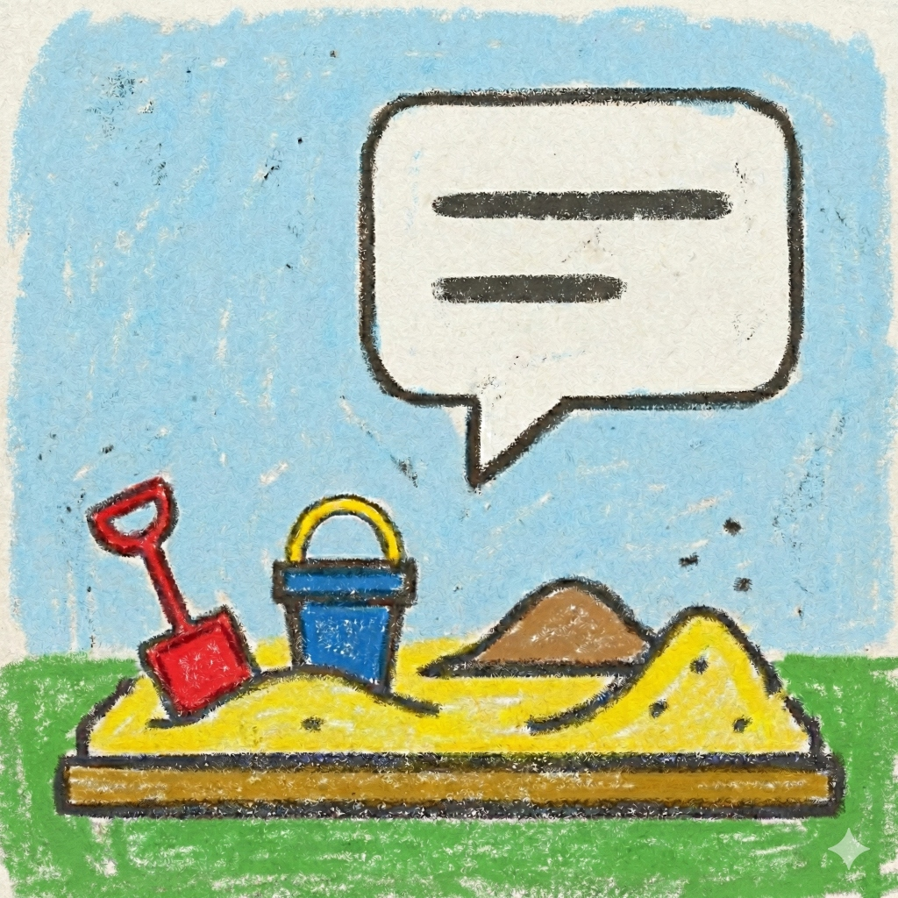
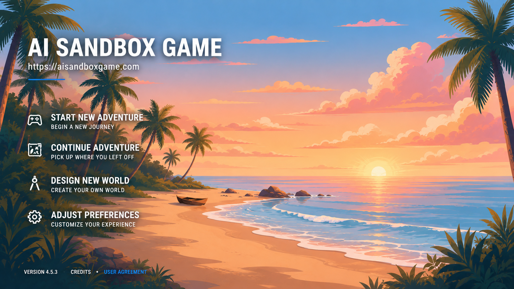

<p align="center">
  
</p>

<h1 align="center">AI Sandbox Game</h1>

<p align="center">
  A local-first, browser-based text RPG driven by large language models.<br>
  Author your own world cards, let AI run the adventure, and bring your own model.
</p>

<p align="center">
  <a href="LICENSE"></a>
  <a href="prompts/LICENSE"></a>
  
</p>

<p align="center">
  
  
  
</p>

<p align="center">
  <a href="https://github.com/hayowei/aisandboxgame/stargazers"></a>
  <a href="https://github.com/hayowei/aisandboxgame/network/members"></a>
  <a href="https://github.com/hayowei/aisandboxgame/issues"></a>
  
</p>

<p align="center">
  
</p>

> **⚠️ Legal & Liability Disclaimer**
>
> This project is a technical framework and interaction layer for AI-driven sandbox adventure experiences. **It does not include any AI models, private service access, or bundled commercial-ready core data.**
>
> Users who download, deploy, or modify this project must connect their own third-party LLM services (such as OpenAI, Anthropic, or other compatible providers). **Any content generated through models connected by the user — including but not limited to pornographic, violent, political, infringing, or otherwise illegal content — is solely the legal responsibility of that user.**
>
> The author of this project assumes no liability and offers no warranty of any kind. Any disputes, reviews, or legal consequences arising from the use of this software are unrelated to the framework author.

> **⚠️ 法律与免责声明**
>
> 本项目是一个面向 AI 沙盒冒险体验的技术框架与交互层。**它不自带任何 AI 模型、私有服务访问权限，也不包含可直接商业化使用的核心数据。**
>
> 下载、部署或修改本项目的使用者，必须自行接入第三方大模型服务（如 OpenAI、Anthropic 或其他兼容提供商）。**使用者通过自行接入的模型所生成的任何内容，包括但不限于色情、暴力、政治、侵权或其他违法内容，均由使用者本人独立承担全部法律责任。**
>
> 本项目作者概不负责，也不提供任何形式的担保。因使用本软件而产生的任何争议、审查或法律后果，均与框架作者无关。

## Introduction

AI Sandbox Game is a browser-based framework for AI-driven text adventures. You bring your own LLM API key, pick or author a world card, and play through streaming, reasoning-driven narration. The framework handles the surrounding systems: NPCs that reason and react with their own cognitive and relationship state, a d20 skill-check engine for resolving actions, persistent saves, inventory and status panels, hex-map navigation, an in-game phone with SMS, character dossiers, slash-command player actions (out-of-character notes, movement, and more), and themed visual styles (parchment, wood, metal, and others).

Authoring is first-class. A built-in design mode interviews you about the world you have in mind and generates a complete, playable world card — setting, characters, locations, and opening scene — from a natural-language description, with an opening wizard to frame your first scene when you start a new game.

Bundled example worlds — a default fantasy setting, a cyberpunk noir, and an Eastern cultivation universe — are starting points; the framework is intended to be reskinned for whatever genre you want.

The framework is plain HTML / CSS / JavaScript, runs from any static file server, and works offline as a PWA after first load. Compatible providers include OpenAI, Anthropic, DeepSeek, Google Gemini, xAI, SiliconFlow, and any OpenAI-compatible endpoint.

## Features

- **Reasoning-driven narration** — streaming output where the model reasons, narrates, and resolves your actions in a single loop.
- **Living NPCs** — characters carry their own cognitive and relationship state and react to what you do.
- **d20 skill checks** — a dice engine resolves uncertain actions across customizable difficulty tiers.
- **World authoring** — an interview-style design mode turns a natural-language pitch into a complete, playable world card (setting, characters, locations, opening scene).
- **Saves & panels** — persistent saves, inventory, status panels, and character dossiers.
- **Exploration** — hex-map navigation and an in-game phone with SMS.
- **Player commands** — slash-command actions for out-of-character notes, movement, and more.
- **Theming** — parchment, wood, metal, and other visual styles.
- **Offline-first** — plain HTML/CSS/JS, no build step, installable as a PWA.

## Community

Questions, ideas, or just want to share a world card? Come say hi:

<p align="center">
  <a href="https://qm.qq.com/q/LYMQ4xXJ2o"></a>
  <a href="https://b23.tv/UiDMUQA"></a>
  <a href="https://discord.gg/JdrUx6hfJ"></a>
</p>

## Dual Licensing

This project separates the framework code from the bundled creative prompt assets.

### 1. Framework Code

The framework code in this public repository is licensed under **AGPL-3.0**. See [LICENSE](LICENSE).

### 2. Prompts & Assets

All files under the `prompts/` directory — including world card data, system prompts, and related narrative/game-design assets — are licensed separately under **CC BY-NC-SA 4.0**.

These bundled prompt assets are provided for learning, research, and non-commercial sharing only. If you intend to commercialize a product built on this framework, you should replace the bundled example prompts and world settings with your own. See [prompts/LICENSE](prompts/LICENSE) and [prompts/README.md](prompts/README.md).

## Getting Started

1. Clone this repository:

   ```bash
   git clone https://github.com/hayowei/aisandboxgame.git
   cd aisandboxgame
   ```

2. Serve the repository as a static site from the project root:

   ```bash
   python3 -m http.server 8080
   ```

3. Open `http://localhost:8080` in your browser.
4. Configure your own API key, provider, and model endpoint inside the app.
5. Start from the bundled example world cards and prompts, then adapt them to your own setup if needed.
