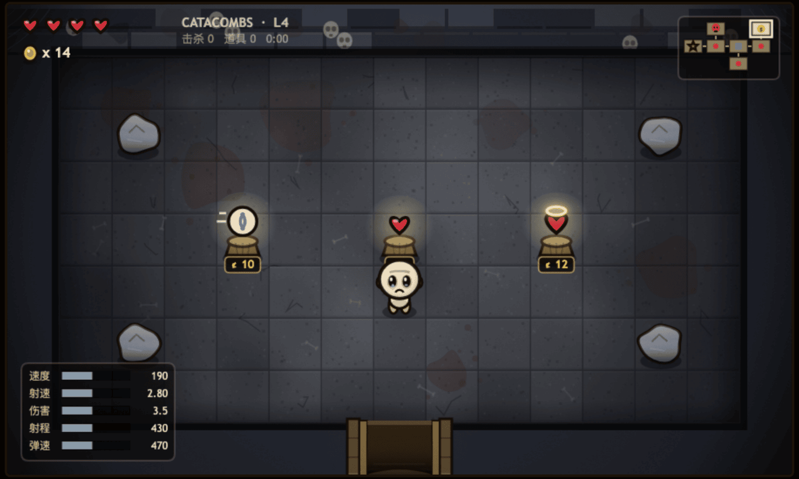

# THE BINDING · 地下室的束缚

一个复刻《以撒的结合》(The Binding of Isaac) 核心玩法的俯视角肉鸽地牢网页游戏。
**12 层地牢、13 个 Boss、11 种敌人、55 件道具**，随机地牢 + 眼泪射击 + 道具构筑，
**全部图形由代码绘制**，不含任何外部美术资源。


<p align="center">
  <a href="https://yisa.codefather.cn"></a>
  
  
  
  
  
</p>

> **一句话总结**：7900 行原生 JavaScript，零依赖、零构建、零图片资源，
> 双击 `index.html` 就能玩完整的 12 层肉鸽。
> 地牢生成算法照着原作源码的逆向分析 1:1 实现，Boss 血量曲线是拿机器人实测 DPS 拟合出来的。

**在线试玩**：**<https://yisa.codefather.cn>**（手机也能玩，会自动出虚拟摇杆）
&nbsp;·&nbsp; **先看图**：[完整截图画廊 →](docs/GALLERY.md)

<table>
<tr>
<td width="33%"></td>
<td width="33%"></td>
<td width="33%"></td>
</tr>
<tr>
<td width="33%"></td>
<td width="33%"></td>
<td width="33%"></td>
</tr>
</table>

---

## 这个项目是怎么做出来的

整个游戏是**用 AI 编程（Vibe Coding）写出来的**，从技术选型、地牢生成算法的资料考证，
到 13 个 Boss 的状态机、55 件道具的程序化图标，再到自动化自测与难度标定，一共约 5 小时 20 分钟。

过程中真正吃时间的不是"让 AI 写代码"，而是**怎么确认它写对了**——所以才有了 `test/` 下那个
能自己打 Boss 的机器人：逻辑问题用断言抓（600 次随机种子验地牢合法性、13 个 Boss 逐个实战），
美术问题只能靠出图人工看（`test/gallery.py` 每层每 Boss 各出一张）。
被这么抓出来的返工不少：Boss 血量从线性缩放改成指数（第一版第 12 层 Boss 只撑 5.9 秒）、
??? 只有头没有身子、机器人自己有三个瞄准 bug 导致 3 局里 2 局卡在第 1 层空转。

---

## 快速开始

想直接玩，打开 **<https://yisa.codefather.cn>** 就行，不用装任何东西。

想跑本地代码：

```bash
git clone https://github.com/liyupi/binding-of-isaac-webgame.git
cd binding-of-isaac-webgame
python3 -m http.server 5006
# 浏览器打开 http://localhost:5006/
```

没有构建步骤、没有 npm 依赖。也可以直接双击 `index.html` 用 `file://` 打开
（脚本用的是普通 `<script>` 标签而非 ES module，正是为了这一点）。

URL 参数：

| 参数 | 作用 |
|---|---|
| `?mobile=1` | 强制显示虚拟摇杆与射击按钮（桌面端调试触控用） |
| `?mute` | 静音启动（自动化测试用） |

---

## 操作

**桌面端**

| 按键 | 作用 |
|---|---|
| `W` `A` `S` `D` | 移动 |
| `↑` `↓` `←` `→` | 向对应方向发射眼泪（同时按住时以最后按下的方向为准，与原作一致） |
| `P` | 暂停 |
| `M` | 开关音效 |
| `Enter` / `Space` | 开始 / 重新开始 |

**移动端**：左下角虚拟摇杆移动（360° 模拟量），右下角四向按钮射击。
竖屏可玩，横屏画面更大（竖屏会提示旋转）。


---

## 技术选型

| 项 | 选择 | 理由 |
|---|---|---|
| 渲染 | 原生 **Canvas 2D**，手写游戏循环 | 需求要求"素材用代码绘制"，程序化绘图是核心工作量所在，游戏框架帮不上忙反而增加体积；同时保证零依赖、可 `file://` 直开 |
| 语言 | 原生 ES2020 JavaScript，无构建 | 交付物要求"浏览器直接打开游玩" |
| 逻辑分辨率 | 固定 900×540（15×9 格 @ 60px），CSS transform 缩放适配 | 与原作 13×7 可行走格的房间比例一致，所有坐标可写死，无需处理分辨率无关逻辑 |
| 随机数 | mulberry32 播种 PRNG | 同一 seed 可复现整层地牢，便于测试与 bug 复现 |
| 音效 | WebAudio 程序化合成 | 同样避免外部资源；射击/受击/死亡/拾取/Boss 咆哮全部实时合成 |
| 自动化测试 | Python Playwright + 页面内 `window.__game` 调试接口 | 真键盘/真触控驱动 + 可断言的游戏状态 |

代码结构：

```
index.html          画布 + 开始/死亡/通关/暂停界面 + 触控 UI
css/style.css       外围界面样式
js/util.js          常量、数学、播种随机、粒子系统、屏幕震动、程序化音效
js/art.js           全部程序化绘图：地板烘焙、墙体、门、角色、5 种敌人、2 个 Boss、
                    眼泪、激光、石头、坑、尖刺、拾取物、基座、宝箱、活板门、后处理
js/dungeon.js       楼层平面生成（复刻原作 BFS 算法）+ 12 层章节表 + 13 种房间布局
                    + 每层敌人池 + Boss 池 + 商店房
js/items.js         55 件道具（含各自的程序化图标与效果）+ 不重复道具池
js/entities.js      玩家、眼泪模板、11 种敌人 AI、13 个 Boss 状态机
js/game.js          状态机、房间生命周期、碰撞、掉落、HUD、小地图、房间切换动画、商店
js/main.js          输入（键盘 + 触控摇杆）、缩放适配、界面流程、window.__game 调试接口
test/               自动化测试（见下）
screenshots/        自测截图
docs/GALLERY.md     截图画廊
```

游戏本体 **7921 行**（`js` 7654 + `css` 194 + `index.html` 73），其中程序化绘图
`js/art.js` 独占 2513 行——这符合"素材全部用代码画"的定位，绘图就是主要工作量。
测试另有 1604 行（Python 1338 + 页面内机器人 266）。

---

## 系统清单

### 12 层地牢（章节表）

层数与命名沿用原作的下坠路线（资料来自 Binding of Isaac Wiki 的 Chapters / Bosses 页面），
每层有独立配色、独立敌人池，以及一个**两选一的 Boss 池**——同一层两次进去不一定是同一个 Boss。

| 层 | 章节 | 主题特征 | Boss 池 |
|---|---|---|---|
| 1 | BASEMENT | 棕石地砖 | MONSTRO / DUKE OF FLIES |
| 2 | CELLAR | 更亮的木色 + 密集蛛网 | LARRY JR. / MONSTRO |
| 3 | CAVES | 灰绿岩石 | CHUB / DUKE OF FLIES |
| 4 | CATACOMBS | 冷灰石 + 地面骨骸 + 墙内头骨 | GURDY / LARRY JR. |
| 5 | DEPTHS | 紫黑石 | MONSTRO II / CHUB |
| 6 | NECROPOLIS | 暗红石 + 骨骸 | MOM / GURDY |
| 7 | WOMB | **血肉地面**（无地砖，血管 + 毛孔） | SCOLEX / MONSTRO II |
| 8 | UTERO | 更深的血肉 | MOM'S HEART / SCOLEX |
| 9 | ? ? ? | 冷蓝血肉 + 发光血管 | HUSH |
| 10 | SHEOL | 焦黑地面 + 余烬光斑 | SATAN |
| 11 | CATHEDRAL | 白色大理石 + 彩窗拱门 | ISAAC |
| 12 | THE CHEST | 金木色 | ? ? ?（BLUE BABY） |

### 随机地牢生成
复刻原作真实算法（依据 Boris the Brave 对原版源码的逆向分析）：

- 9×8 网格，从起始房间 BFS 向外扩张
- 候选格若**已有超过 1 个已填充邻居则拒绝**——这条规则正是原作地牢"只有走廊、没有环路"的来源
- 记录所有死胡同；**Boss 房放在离起点最远的死胡同**，宝物房与商店占用其余死胡同
- Boss 房不允许与起始房相邻，不满足则整层重新生成
- 房间数随深度增长：第 1 层 **5–6 间**，第 12 层 **13 间**
- 相邻房间在共享墙正中开门，门分普通 / 宝物（金色 + 星星）/ 商店（金币 $）/
  Boss（红色 + 骷髅）四种外观
- **13 种房间布局模板**（空房、四角、立柱、菱形、坑洞群、断行、尖刺环、镜像散布、
  尖刺走廊、双坑、竞技场、对角碎石等），自动保留门前通道**与房间正中格**，
  确保四方向永远可达

小地图实时显示已探索房间、当前位置、Boss 房（骷髅）、宝物房（星星）、商店（$）、未清房（红点）；
房间多的深层会自动缩小格子，避免盖住战场。

### 商店
第 2 层起、房间数足够时出现。三个货架，价格随深度上涨；卖道具，偶尔卖一颗红心
（生命上限 +1 并回满）。钱不够会提示差多少——金币从此有了用处。



### 射击战斗
- 眼泪继承部分玩家速度（原作手感）、带高度与落地飞溅、命中有击退
- 射速冷却、屏幕震动、**命中停顿**（hit-stop，命中瞬间冻结几帧）、受击白/红描边闪烁、血液粒子与永久地面血渍
- 受击有**硬直**（0.2s），击退才真正推得动人——否则移动代码下一帧就把冲量抹平，
  导致无敌帧一结束立刻被连续命中

### 普通敌人（11 种，移动与攻击模式各不相同）

| 敌人 | 移动 | 攻击 / 特性 |
|---|---|---|
| **Gaper** 哭脸怪 | 直线追击，进入视野后永久加速 | 接触伤害 |
| **Pooter** 飞蝇 | 悬空、保持中距、横向游走（飞行，无视地形） | 定期单发瞄准弹 |
| **Horf** 吐口怪 | 完全固定（只被击退推动） | 3 连扇形弹幕 |
| **Attack Fly** 苍蝇 | 高速不规则突进、撞墙反弹 | 接触伤害 |
| **Clotty** 血块 | 缓慢跳跃逼近 | 四向十字齐射 |
| **Boom Fly** 爆炸蝇 | 匀速直线漂移、撞墙反弹 | **死亡时爆炸**：环形弹幕 + 范围伤害 |
| **Hopper** 跳虫 | 蓄力后一次性大跳（滞空无法被击中位移） | 接触伤害 |
| **Maw** 血口 | 悬空保持远距 | 蓄力后吐一颗**两倍伤害的巨型血球** |
| **Globin** 泥人 | 直线追击 | **第一次被打死只会瘫成一滩，2.4 秒后重组复活** |
| **Knight** 骑士 | 朝面向缓慢推进，面甲转向有延迟 | **正面 92% 免伤**——必须绕到背后打 |
| **Vis** 血肠 | 缓慢逼近 | 锁定方向蓄力 0.85s 后发射**贯穿全场的血腥激光**（紫色，可侧步躲开） |

所有敌人进入房间时有 0.55s（Boss 0.9s）**具现化保护期**（浮现动画 + 光环），
避免开门瞬间白送一颗心。第 9 层起普通敌人接触伤害 +1。


*（图中为第 1 层敌人池的几种；11 种敌人的完整外观见 [截图画廊](docs/GALLERY.md#战斗与构筑细节)）*

### Boss（13 个，每个都有独立状态机与程序化绘图）

| Boss | 出场层 | 核心机制 |
|---|---|---|
| **MONSTRO** | 1, 2 | 蓄力压扁 → 跳跃冲撞；呕吐散射；高跳砸向玩家落点（红圈预警）+ 环形弹幕；50% 血狂暴 |
| **DUKE OF FLIES** | 1, 3 | 悬空漂移，召唤苍蝇群、环形吐弹、直线冲刺 |
| **LARRY JR.** | 2, 4 | 5 节身躯的蠕虫，**只走四方向**、撞墙时朝玩家转向；定期从尾节喷环形弹；整条身体都是碰撞伤害也都能被打 |
| **CHUB** | 3, 5 | 三节肥虫，与玩家在某一轴对齐时**张嘴蓄力然后高速冲撞**，撞墙炸出弹幕并吐出苍蝇 |
| **GURDY** | 4, 6 | 钉死在房间顶部的肉瘤墙，5 连扇形弹 / 10–12 发环形弹 / 召唤飞行小怪 |
| **MONSTRO II** | 5, 7 | 两连跳砸（首次落地 8 向弹幕），**扫射式血腥激光**（起手角度锁定后横扫），召唤 Maw/Boom Fly |
| **MOM** | 6 | 天花板伸下的巨腿：影子锁定玩家后**踩击**（把石头一起踩碎），落地窗口才能被打伤；从门缝伸出**眼睛**持续点射；召唤 Globin/Hopper |
| **SCOLEX** | 7, 8 | 钢甲蠕虫，**只有闪光的尾节能被打**；大部分时间钻地无敌，破土后高速滑行并从尾部反向喷弹 |
| **MOM'S HEART** | 8 | 顶部悬吊的心脏，四套弹幕（脉冲环 / 双螺旋 / 瞄准帘幕 / 追踪直线）交替，中间召唤小怪波次；60% 血进入二阶段 |
| **HUSH** | 9 | 每掉 20% 血就**沉入地面清屏并换位**；带缺口的密集弹环、旋转齐射、U 形扇形、四向激光十字 |
| **SATAN** | 10 | 三阶段：扇形连射 → 双手半环弹 + 横扫激光 → **离地踩击**（影子预警）+ 召唤爆炸蝇 |
| **ISAAC** | 11 | 三阶段：10 向辐射弹 / 弧线回旋弹 → 激光十字 → **长出翅膀预判走位冲刺**；全程有瞄准点射 |
| **? ? ?** | 12 | 最终 Boss。与 Isaac 同形但更快，**所有子弹带追踪**，持续召唤环绕苍蝇，六向激光 + 冲刺 |

Boss 的接触伤害只在它真正扑上来时生效（`e.aggro`），站在发呆的 Monstro 旁边不会掉血——
危险的是它每一次有前摇的攻击。

### 道具系统（55 件，可叠加）
掉落途径：宝物房基座（必得）、宝箱（木/金）、Boss 击杀奖励（必得）、商店购买、
击杀敌人小概率。一局内不重复（道具池洗牌）。

**改变攻击方式**（21 件）
Brimstone（蓄力血腥激光）、Technology（穿透激光弹）、The Inner Eye（三重射击）、
20/20（双重射击）、Mutant Spider（四重射击）、Spoon Bender / Sacred Heart（追踪）、
Cupid's Arrow（穿透）、My Reflection（回旋）、Polyphemus（巨型眼泪）、
Loki's Horns（25% 四向齐射）、Cube of Meat（环绕肉块）、
**Ipecac**（眼泪落地爆炸，会炸到自己）、**Rubber Cement**（撞墙反弹）、
**The Common Cold**（中毒持续掉血）、**Mom's Contact**（命中减速 55%）、
**Ouija Board**（幽灵眼泪穿透石头）、**The Parasite**（落地分裂成两颗）、
**Tough Love**（25% 概率射出三倍伤害的牙齿）、**A Lump of Coal**（飞得越远伤害越高）、
**Proptosis**（起手三倍伤害、越飞越弱）、**Godhead**（眼泪自带伤害光环）、
**Soy Milk**（射速暴涨 + 单发伤害暴跌）

**改变生存方式**（7 件）
**Holy Mantle**（每个房间免疫第一次伤害，有可见护盾泡）、**The Wafer**（所有伤害 -1）、
**1UP!** / **Dead Cat**（死亡时原地复活）、**Brother Bobby** / **Sister Maggy**
（跟随的小跟班自动向最近敌人开火）、**Magneto**（拾取物自动飞向你）

**改变属性数值**（20 件）
Sad Onion、Number One、Wire Coat Hanger、Nine Volt、Rosary、Odd Mushroom（射速）、
Cricket's Head、Blood of the Martyr、Max's Head、Steven、Blood Clot、Iron Bar、
Taurus、The Necronomicon、Ceremonial Robes（伤害）、Speed Ball、The Belt（移速/弹速）、
Breakfast（生命上限）、Lucky Foot（幸运）

**改变角色外观**（8 件）
Magic Mushroom（体型变大 + 红斑）、Lord of the Pit（恶魔翅膀 + 飞行，可越过坑洞）、
**Transcendence**（整个人浮空）、The Halo / Godhead / Sacred Heart（头顶光环）、
Pentagram / Ceremonial Robes（暗紫光环）、**The Mark**（脚下旋转的血色印记）、
Cube of Meat（环绕肉块）、Holy Mantle（护盾泡）


### 属性系统
生命值（半心为单位，起始 4 心）、伤害、射速、射程、弹速、移速。
左下角**常驻属性面板**用横条展示相对基准值的高低（高于基准蓝色、低于基准红色），
右侧显示当前数值；面板下方一排显示已拾取道具的图标。

### 难度曲线
玩家的输出是**复利式**增长的——每件道具都在上一件的结果上加或乘，实测机器人从第 1 层到
第 12 层 DPS 增长约 20 倍。所以血量也必须复利增长，否则后期 Boss 5 秒就被融掉
（第一版线性缩放时真的如此）。最终取 Boss `1.28^(层数-1)`、杂兵 `1.24^(层数-1)`，
指数是拿 `test/calibrate.py` 实测的 DPS 曲线拟合出来的，不是拍脑袋定的。

### 完整流程
开始界面 → 12 层地牢 → 每层打完 Boss 拿奖励道具 + 踏入活板门下一层 → 第 12 层
击败 ??? 后通关。死亡界面显示**击杀数 / 拾取道具数 / 存活时间 / 到达层数 /
探索房间 / 击败 Boss 数**及道具清单。


### 美术风格（全代码绘制）
参考原作视觉特征：极重的近黑描边、病态苍白的肉色、褪色脏污的棕石、无处不在的血。

- 地板每间房**烘焙一次**到离屏 canvas：逐格随机石色、颗粒噪点、裂纹、
  大尺度有机斑块（打散网格感）、四角积垢、干涸血渍与飞溅点
- **Womb 系章节完全换一套烘焙**：没有地砖网格，改成层叠的血肉瓣 + 爬行的血管 + 毛孔，
  墙面也跳过砖缝改用搏动的膜；? ? ? 层把血管换成冷蓝发光
- 章节点缀直接烘进地板：Catacombs / Necropolis 撒骨骸并在墙里嵌头骨，
  Sheol 烧出余烬光斑，Cathedral / The Chest 打上大理石纹与彩窗拱门的暖光
- 墙体砖缝错缝排布、墙面血渍、墙角蛛网、墙脚投影渐变
- 门有拱券、门框砖缝、开启时门板缩进 + 暖光溢到地面；关闭时双门板 + 骷髅/星星/门钉装饰
- 角色：巨大光头 + 小身体 + 永久流泪的下垂眼 + 皱眉阴影；朝上时画后脑（渐变头顶 + 后颈折线 + 发丝），不是一颗白蛋
- 敌人绘图在**固定参考半径下作画后整体缩放**，所以调整碰撞半径不会让五官和身体脱节
- 后处理：径向暗角 + 叠加胶片颗粒

---

## 自测结果

全部用本机 Playwright 真实驱动页面（真键盘 `keyboard.down/up`、真触控 `mouse`），
不是纯单元测试。

```bash
python3 test/smoke.py       # 结构冒烟：12 层 / 13 Boss / 55 道具 / 11 敌人 全部可运转
python3 test/playtest.py    # 70 项功能断言 + 截图
GB=80 python3 test/bossfight.py            # 13 个 Boss 逐个实战可胜性（无无敌）
RUNS=4 BUDGET=600 python3 test/botrun.py   # 机器人全流程试玩
python3 test/calibrate.py   # 实测每层机器人 DPS，用来标定 Boss 血量曲线
python3 test/gallery.py     # 每层 + 每个 Boss 各出一张图，供人工看图复查
python3 test/visual.py      # 摆拍特定场景的美术复查截图
```

### 1. 结构冒烟 `test/smoke.py` — **11 / 11 通过**

秒级的整体性检查：12 层章节表与 `MAX_FLOOR` 一致、55 件道具 id 无重复、
13 种 Boss、24 个敌人定义；然后**逐层生成并渲染**、**逐个 Boss 生成并跑完状态机再打死**、
**11 种普通敌人同屏运转**、**55 件道具一口气全叠加**，最后断言零 console 报错。
这是那种"改了个函数名忘了改调用点"能在几秒内被抓住的测试。

### 2. 功能断言 `test/playtest.py` — **70 / 70 通过**

覆盖原有的 54 项（移动、射击、房间生命周期、道具拾取与叠加、Boss 流程、
死亡/通关界面、移动端摇杆与画布缩放、帧率、console）之外，新增：

- **600 次随机种子 × 全部 12 层**地牢生成：房间数 5–13、恰好 1 Boss + 1 宝物房、
  商店房至多 1 个、**Boss 必须来自本章节的 Boss 池**、
  每扇门在邻居侧都有对应反向门且网格坐标相邻、所有房间从起点可达 —— 600/600 合法。
  房间数分布 5:27 / 6:71 / 7:78 / 8:53 / 9:67 / 10:75 / 11:54 / 12:44 / 13:131，
  13 个 Boss 全部出现过。
- **商店**：没钱时走上去买不走东西；给够钱后自动成交、正确扣款、确实拿到道具或红心。
- **Holy Mantle**：第一次受伤血量不变，第二次正常掉血。
- **1UP**：致命伤变成原地复活而不是结束游戏。
- **中毒**：眼泪消失之后敌人仍在持续掉血。
- **跟班**：玩家全程不开火，靶子血量仍在下降 —— 伤害只可能来自跟班。
- **Knight**：正面 20 点伤害只吃到 1.6，背面吃满 20。
- **Globin**：第一次被打死不算死，瘫成一滩后重组。

### 3. Boss 战可胜性 `test/bossfight.py` — **10 / 13 击杀，13 个全部被打到 78% 血量以下**

每个 Boss 在它自己的楼层、用"每层 2 件道具"的合理配装、由机器人在**无无敌**状态下实战：

| 层 | Boss | 结果 | Boss 血量 | 玩家剩余 | 用时 |
|---|---|---|---|---|---|
| 1 | MONSTRO | **击杀** | 160 → 0 | 8/8 | 15.1s |
| 1 | DUKE OF FLIES | **击杀** | 140 → 0 | 7/8 | 26.3s |
| 2 | LARRY JR. | **击杀** | 243 → 0 | 4/8 | 20.1s |
| 3 | CHUB | **击杀** | 393 → 0 | 6/10 | 22.5s |
| 4 | GURDY | **击杀** | 545 → 0 | 5/10 | 12.2s |
| 5 | MONSTRO II | **击杀** | 805 → 0 | 2/12 | 16.9s |
| 6 | MOM | 死亡 | 1031 → 231（打掉 78%） | 0 | 11.9s |
| 7 | SCOLEX | 死亡 | 1319 → 163（打掉 88%） | 0 | 9.5s |
| 8 | MOM'S HEART | 死亡 | 1801 → 344（打掉 81%） | 0 | 34.6s |
| 9 | HUSH | **击杀** | 2450 → 0 | 12/16 | 25.8s |
| 10 | SATAN | **击杀** | 3320 → 0 | 6/16 | 20.8s |
| 11 | ISAAC | **击杀** | 4486 → 0 | 4/18 | 38.8s |
| 12 | ? ? ? | **击杀** | 6347 → 0 | 4/18 | 74.6s |
| — | **对照组**：L12 ??? + **0 道具** | 死亡 | 打掉 0% | 0 | — |

三次失手集中在 MOM / SCOLEX / MOM'S HEART —— 这三个的攻击最难被"只在轴对齐时开火"的
机器人躲开（Mom 的踩击追着你落点、Scolex 只有尾巴能打、Mom's Heart 是纯弹幕）。
它们仍被打到只剩 12%–19% 血。零道具对照组在最终层连 1% 都打不掉，说明构筑确实决定战力。

### 4. 机器人全流程试玩 `test/botrun.py` — **无死锁、无报错**

`test/bot.js` 是一个页面内机器人，**只通过和人类相同的输入接口**
（`__game.press/release/move`）操作：瞄准时先在某一轴对齐再开火（四向射击必须走位）、
风筝拉距、躲避飞来的眼泪、绕开石头与坑、Boss 蓄力时侧向拉开、
先探索完普通房再打 Boss、卡住时随机脱困。

本次为了让测试结果诚实，还修了机器人自己的三个毛病：
**射线被石头挡住时会侧移让开**、**目标超出射程时会主动贴近**、
**对齐用的那条轴不再受"别贴墙"约束**（否则角落里的敌人永远瞄不准）。
改之前 3 局里有 2 局卡在第 1 层空转 420 秒。

最近一轮（600 游戏秒预算，4 局）：

| 局 | 结果 | 到达层 | 击败 Boss | 击杀 | 道具 | 游戏内时长 |
|---|---|---|---|---|---|---|
| 1 | 预算截断 | **6 / 12** | **5** | 108 | 14 | 600.5s |
| 2 | 死亡 | 2 / 12 | 1 | 15 | 3 | 88.4s |
| 3 | 死亡 | 2 / 12 | 1 | 20 | 4 | 100.6s |
| 4 | 死亡 | 3 / 12 | 2 | 36 | 4 | 149.3s |

累计击败 **9 个 Boss**、4/4 局都推进到第 2 层以上、**0 死锁**、0 console 报错。
第 1 局 108 击杀 / 14 道具 / 5 个 Boss 的滚雪球曲线说明
"清房 → 拿道具 → 变强 → 下一层"的构筑循环在 12 层的长度上依然成立。

### 5. 难度标定 `test/calibrate.py`

把机器人扔进每层的 Boss 房打一个不会还手的无限血靶子，实测它 18 游戏秒内造成多少伤害。
结论：从第 1 层到第 12 层输出增长约 **20 倍**（不是我最初估算的 50 倍），
Boss 血量的指数就是照这条曲线定的。第一版按线性缩放时，第 12 层 Boss 只撑 5.9 秒。

### 6. 美术复查
`test/gallery.py` 为**每一层出一张战斗房截图、每一个 Boss 出一张开打截图**，
`test/visual.py` 另外摆拍敌人一览、命中反馈、满配角色、Brimstone 激光等场景，
逐张人工看图评估是否贴近原作，不像就改画法重截。本轮据此修掉了
??? 只有头没有身子、撒旦的角太小、妈妈的脚看不出是脚、
Womb 层墙上还留着砖缝、Catacombs 骨头大得抢戏、深层小地图盖住战场 等问题。


---

## 已知限制

- **测试挂钟**：本机同时跑多个 Agent，页面常拿不到 60fps（最差出现过 905s 挂钟只推进
  8.3 游戏秒）。因此所有测试预算改为按**游戏内时间**计而非挂钟。
  游戏自身帧率在空闲时 94–114fps，重载时仍 ≥57fps。
- 机器人的走位远不如人类（只在轴对齐时开火、不会预判弹幕），它的通关率是**可玩性下限**
  而非上限。没有任何一局机器人完整通关 12 层——按它的推进速度，需要约 1200 游戏秒的预算，
  在这台机器上是几个小时的挂钟时间。
- 有商店了，但仍没有实现原作的祭坛、诅咒房、天使房、炸弹、钥匙、饰品与**主动道具**；
  55 件道具全部是被动的。
- 房间形状只有标准 1×1（原作 Rebirth 才加入 2×2、L 形等异形房）。
- 每层的 Boss 池是两选一而非原作那样十几选一；第 9–12 层各只有一个固定 Boss
  （这一点与原作一致——Hush / Satan / Isaac / ??? 本来就是唯一的层主）。
- 难度曲线是照机器人的 DPS 标定的。人类玩家比机器人强得多，
  所以对人来说前中期可能偏轻松；如果拿到 Brimstone / Polyphemus 这类强力构筑会更明显。

---

## 参与贡献

改动前建议先跑一遍测试，尤其是 `test/smoke.py`（几秒钟，能抓住绝大多数"改了名字忘了改调用点"）
和 `test/playtest.py`（70 项功能断言）。测试依赖 Python + Playwright：

```bash
pip install playwright && playwright install chromium
python3 test/smoke.py && python3 test/playtest.py
```

改了绘图相关代码，请顺手跑 `python3 test/gallery.py` 或 `python3 test/visual.py` 重出截图人工看一眼——
美术问题断言不出来，只能看图。

想加内容的话，几个天然的切入点：`js/items.js` 加道具（每件就是一个带 `icon` 绘制函数和
效果钩子的对象）、`js/entities.js` 加敌人或 Boss（一个状态机 + 一个绘图函数）、
`js/dungeon.js` 加房间布局模板或章节。

## 许可

[MIT](LICENSE)。代码、程序化绘图与音效合成部分可自由使用。

## 致敬与免责

本项目是对 Edmund McMillen 与 Florian Himsl 的《The Binding of Isaac》
（及 Nicalis 发行的 Rebirth）的**致敬性同人复刻**，与原作者、发行商均无关联，未获其授权。

游戏机制参考了公开资料：[Boris the Brave 对原作地牢生成算法的逆向分析](https://www.boristhebrave.com/2020/09/12/dungeon-generation-in-binding-of-isaac/)
和 [Binding of Isaac Rebirth Wiki](https://bindingofisaacrebirth.fandom.com/)。
道具名、敌人名、Boss 名沿用原作以便对照，**但不含任何一份原作的美术、音频或代码资源**——
本仓库里所有图形都是 Canvas 2D 现场画的，所有音效都是 WebAudio 现场合成的。
如果你喜欢这套玩法，请去支持[原作](https://store.steampowered.com/app/250900/)。

完整声明见 [DISCLAIMER.md](DISCLAIMER.md)。
